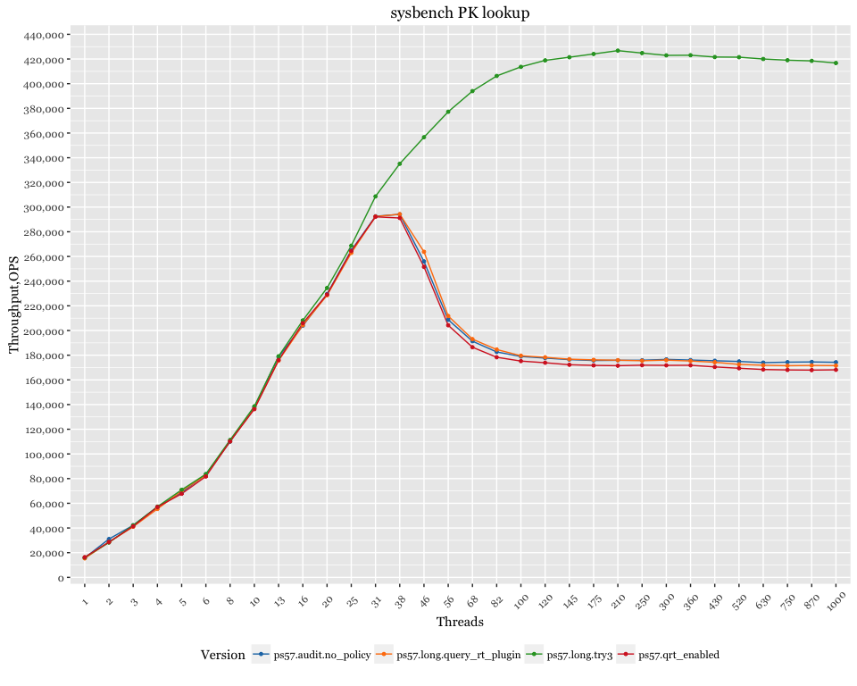
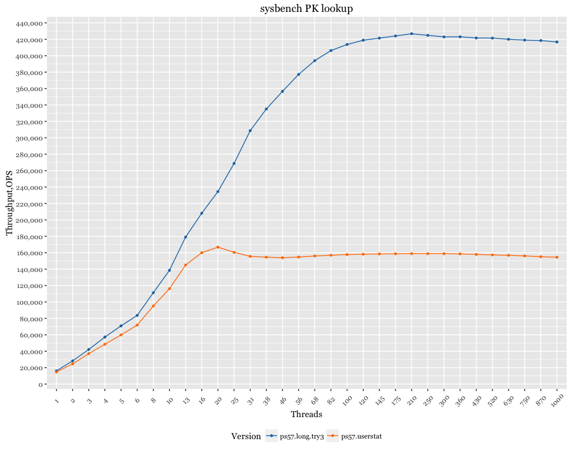
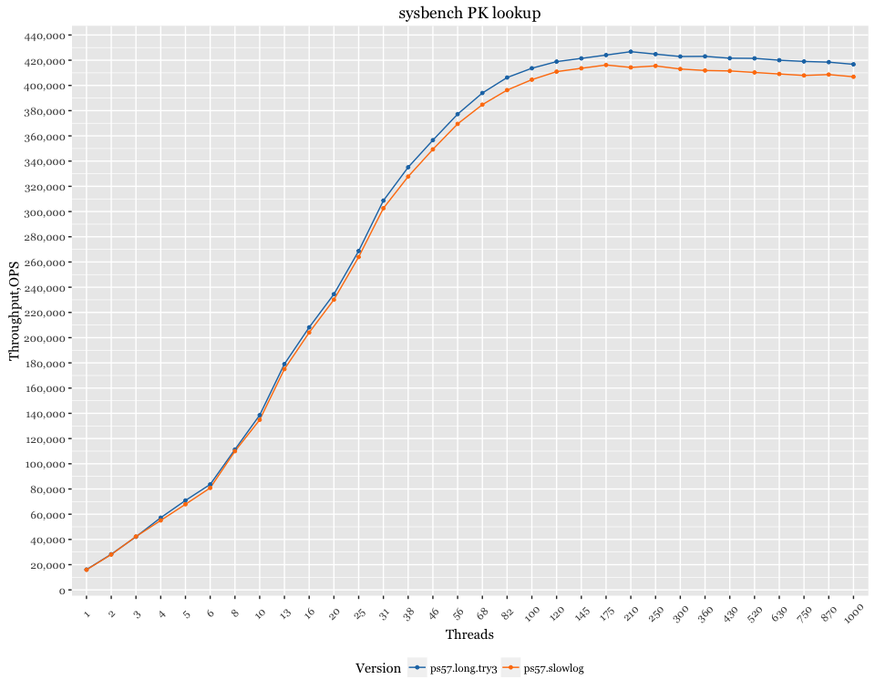

Percona Server 5.7 - monitoring overhead
========================================

Setup
-----

-   Client (sysbench) and server are on the same server
-   CPU: 56 logical CPU threads servers Intel(R) Xeon(R) CPU E5-2683 v3 @ 2.00GHz
-   sysbench 100 tables x 1mln rows, uniform distribution
-   OS: Ubuntu 15.10 (Wily Werewolf)
-   Kernel 4.2.0-30-generic

Results with plugins
--------------------

-   PS 5.7
-   query\_rt\_plugin : `query_response_time` plugins installed (but `query_response_time_stats = off`)
-   qrt\_enabled: `query_response_time` plugins installed and `query_response_time_stats = on`
-   audit.no\_policy: audit plugin installed, but `audit_log_policy=NONE`

Results with userstat
---------------------

-   PS 5.7
-   userstat - userstat enabled (`userstat=1`)

Results with slowlog
--------------------

-   PS 5.7
-   slowlog - slowlog enabled
    -   slow-query-log=ON
    -   slow-query-log-file=slow.log
    -   long\_query\_time=0
    -   loose\_slow\_query\_log\_use\_global\_control=all
    -   loose\_log\_slow\_verbosity=full
    -   loose\_log\_slow\_rate\_type=query
    -   loose\_log\_slow\_rate\_limit=5000
    -   loose\_slow\_query\_log\_use\_global\_control=all
    -   loose\_slow\_query\_log\_always\_write\_time=1

