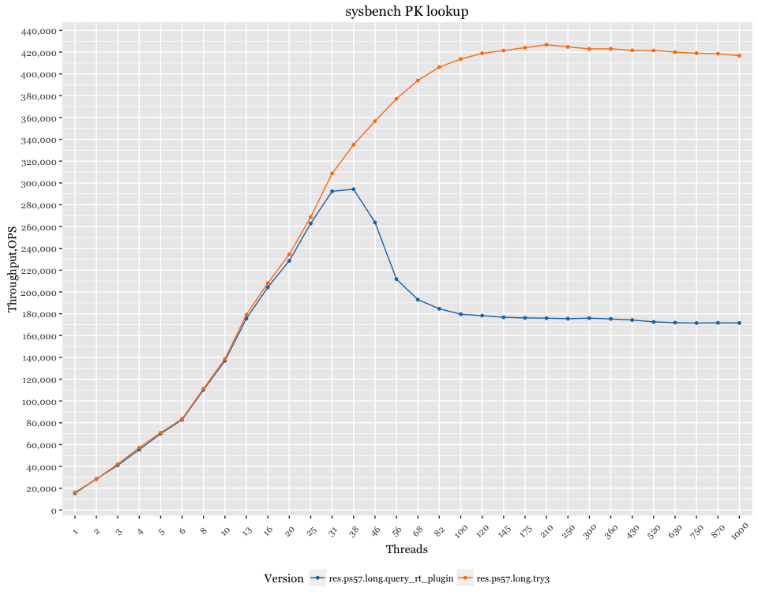

Percona Server 5.7 - monitoring overhead
========================================

Setup
-----

-   Client (sysbench) and server are on the same server
-   CPU: 56 logical CPU threads servers Intel(R) Xeon(R) CPU E5-2683 v3 @ 2.00GHz
-   sysbench 100 tables x 1mln rows, uniform distribution
-   OS: Ubuntu 15.10 (Wily Werewolf)
-   Kernel 4.2.0-30-generic

Results with query\_response\_time plugin
-----------------------------------------

-   Vanilla PS 5.7
-   `query_response_time` plugins installed (but `query_response_time_stats = off`)

