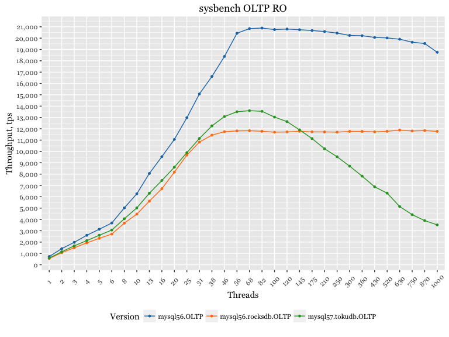
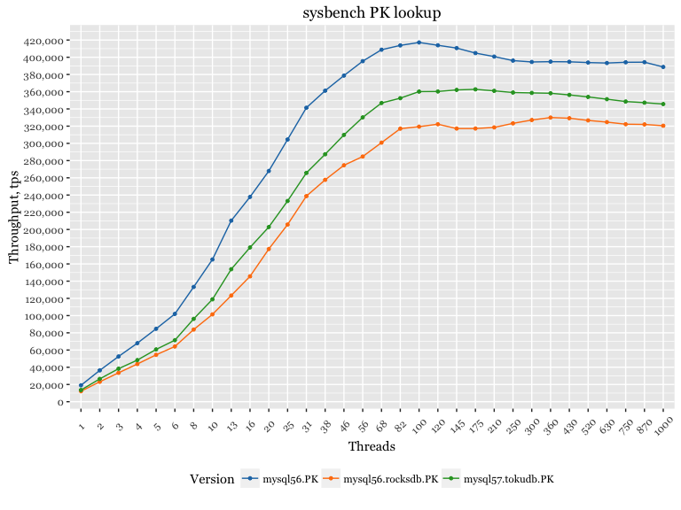

MySQL 5.7 / 5.6 / 5.5 - OLTP RO workload (local connection)
===========================================================

Setup
-----

-   Client (sysbench) and server are the same server
-   CPU: 56 logical CPU threads servers Intel(R) Xeon(R) CPU E5-2683 v3 @ 2.00GHz
-   sysbench 10 tables x 10mln rows, pareto distribution
-   OS: Ubuntu 15.10 (Wily Werewolf)
-   Kernel 4.2.0-30-generic

Results under OLTP RO pareto
----------------------------

Results under PK lookup
-----------------------

