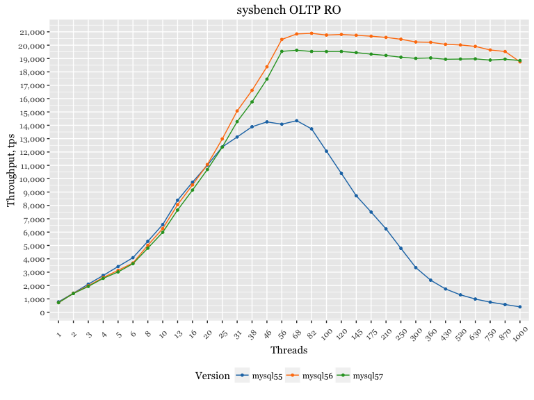

MySQL 5.7 - OLTP RO workload (local connection)
===============================================

Setup
-----

-   Client (sysbench) and server are the same server
-   CPU: 56 logical CPU threads servers Intel(R) Xeon(R) CPU E5-2683 v3 @ 2.00GHz
-   sysbench 10 tables x 10mln rows, pareto distribution
-   OS: Ubuntu 15.10 (Wily Werewolf)
-   Kernel 4.2.0-30-generic

Results under OLTP RO pareto
----------------------------

-   MySQL 5.7 / 5.6 / 5.5
    -   MySQL 5.6 uses `START TRANSACTION READ ONLY`

### Relative performance

-   base value: MySQL 5.7 (horizontal line 1.0)

MySQL 5.6 without `START TRANSACTION READ ONLY`
-----------------------------------------------

MySQL 5.6/5.7 without `innodb-adaptive-hash-index`
--------------------------------------------------

-   AHI0 - `innodb_adaptive_hash_index=0`

