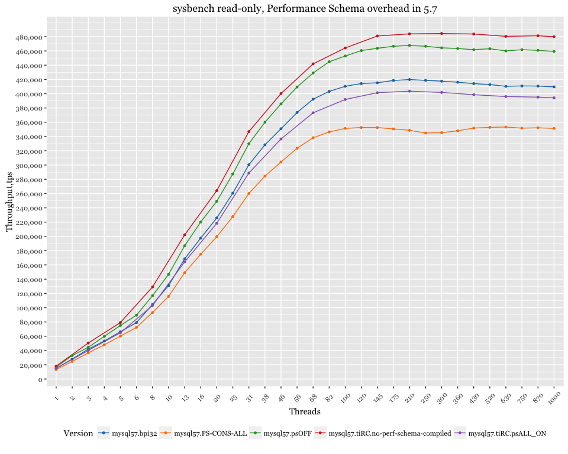

MySQL 5.5 / 5.6 / 5.7 - sysbench PK lookup queries in memory
============================================================

Setup
-----

-   Client (sysbench) and server are on the same server
-   CPU: 56 logical CPU threads servers Intel(R) Xeon(R) CPU E5-2683 v3 @ 2.00GHz
-   sysbench 100 tables x 1mln rows, uniform distribution

Performance Schema overhead in 5.6
----------------------------------

-   psOFF - MySQL 5.6 started with `--performance-schema=OFF`
-   mysql56.tiRC.no-perf-schema-compiled - `PERFORMANCE_SCHEMA` was not compiled

Performance Schema overhead in 5.7
----------------------------------

-   psOFF - MySQL 5.7 started with `--performance-schema=OFF`
-   psALL\_ON - MySQL 5.6 started with `--performance-schema-instrument='%=ON'`
-   mysql57.tiRC.no-perf-schema-compiled `- PERFORMANCE_SCHEMA` was not compiled
-   mysql57.PS-CONS-ALL - `--performance-schema-instrument='%=ON'` and `update performance_schema.setup_consumers set enabled='yes';`

### Relative performance

base value with `--performance-schema=ON`

InnoDB\_Metrics overhead in 5.7
-------------------------------

-   mysql57.ibpi32.imON - MySQL 5.7 with `INNODB_METRICS` enabled (all) (`innodb_monitor_enable = '%'`)

Tabular format
--------------

|  Threads|  MySQL 5.5|  MySQL 5.6|  MySQL 5.6 Perf\_schema OFF|  MySQL 5.7|  MySQL 5.7 Perf\_schema OFF|
|--------:|----------:|----------:|---------------------------:|----------:|---------------------------:|
|        1|   22588.99|   16762.94|                    20720.66|   15206.00|                    16965.74|
|        2|   41043.80|   34782.86|                    37784.93|   27987.05|                    32911.72|
|        3|   57805.33|   51532.73|                    55935.16|   41892.49|                    44462.01|
|        4|   75356.37|   68001.79|                    72551.91|   53313.79|                    59773.84|
|        5|   90618.89|   81987.92|                    89340.83|   66315.78|                    75140.89|
|        6|  106733.32|   98123.77|                   105827.56|   79068.86|                    89465.83|
|        8|  137936.41|  130472.50|                   139920.39|  104568.97|                   116866.03|
|       10|  168095.38|  161824.04|                   172171.03|  130944.38|                   146700.39|
|       13|  197968.19|  206475.18|                   218440.88|  168443.49|                   186810.27|
|       16|  218251.16|  233505.38|                   245751.05|  197516.45|                   220047.01|
|       20|  227247.29|  265014.48|                   281621.70|  225822.72|                   249182.30|
|       25|  242784.28|  301128.36|                   318541.83|  260607.33|                   287469.26|
|       31|  245424.93|  337320.61|                   359676.86|  300452.09|                   329931.06|
|       38|  235518.17|  356666.43|                   379616.62|  328393.80|                   360029.10|
|       46|  226039.71|  377083.88|                   399701.37|  350903.97|                   385700.17|
|       56|  213440.34|  393956.52|                   417787.21|  373665.97|                   409374.05|
|       68|  211256.16|  409691.70|                   433235.43|  392313.33|                   429086.00|
|       82|  210674.53|  416270.60|                   440210.96|  403242.77|                   444762.73|
|      100|  210107.36|  420210.97|                   437821.43|  410379.11|                   452848.95|
|      120|  195114.07|  417149.76|                   434773.13|  414244.79|                   460480.87|
|      145|  173935.01|  413809.35|                   430867.49|  415353.88|                   463688.77|
|      175|  135920.05|  410554.13|                   427284.75|  418575.67|                   466536.23|
|      210|  103566.92|  403483.15|                   423971.52|  419883.96|                   467697.89|
|      250|   73852.42|  401369.60|                   419453.82|  418734.91|                   466516.86|
|      300|   53322.26|  399021.04|                   413392.06|  417605.67|                   464344.74|
|      360|   40167.48|  399686.84|                   409330.64|  416116.24|                   463372.74|
|      430|   31310.51|  399108.23|                   405040.47|  414203.16|                   461739.56|
|      520|   23822.91|  399083.03|                   399999.21|  412798.77|                   463047.02|
|      630|   17945.75|  399547.30|                   390764.74|  410329.70|                   459987.08|
|      750|   13834.82|  400288.65|                   384763.37|  410895.51|                   461680.98|
|      870|   10879.58|  400180.58|                   362852.30|  410690.11|                   460786.68|
|     1000|    8409.07|  399618.70|                   341816.72|  409618.95|                   459372.58|
