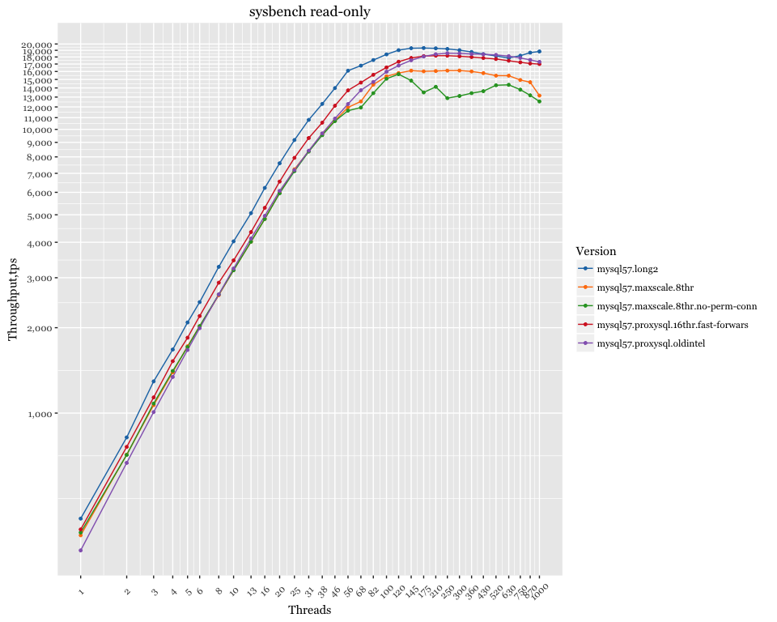
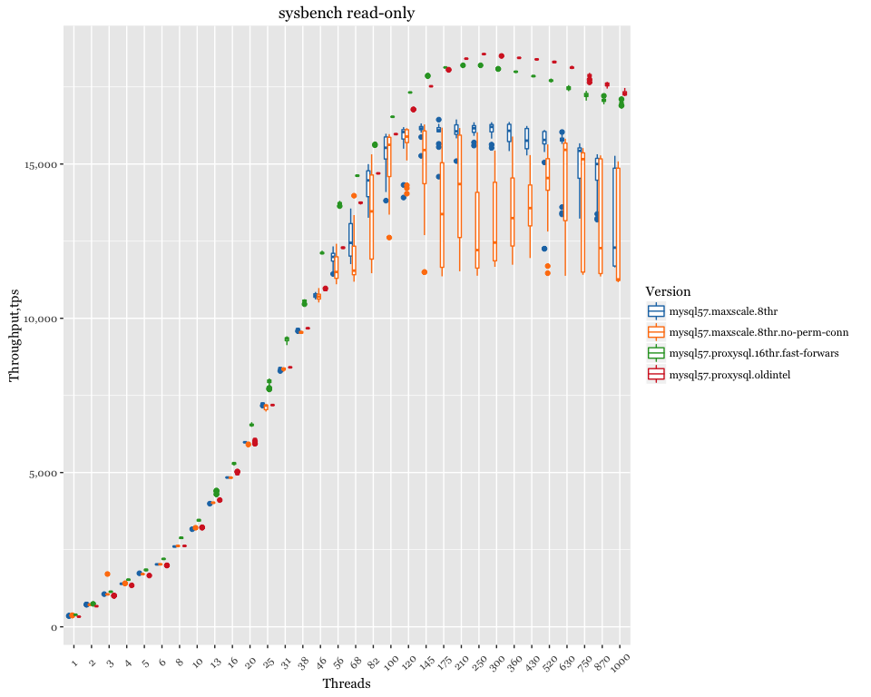

MySQL 5.7 - proxy overhead
==========================

Setup
-----

-   Client (sysbench) and server are on different servers, connected via 10Gb network.
-   CPU: 56 logical CPU threads servers Intel(R) Xeon(R) CPU E5-2683 v3 @ 2.00GHz
-   sysbench 10 tables x 10mln rows, pareto distribution
-   OS: Ubuntu 15.10 (Wily Werewolf)
-   Kernel 4.2.0-30-generic

-   MaxScale 1.4.1 - self compiled

Results
-------

### MaxScale variance on high threads

### Relative performance

base value: MySQL 5.7

Previous Results with proxysql
------------------------------

-   Vanilla MySQL 5.7
-   ProxySQL `mysql-threads=16`
-   MaxScale 1.3.0
-   MaxScale `threads=4`
-   MaxScale `threads=8`
-   MaxScale `threads=16`

ProxySQL is running on the same host with sysbench, connected via unix-socket

### Relative performance

base value: MySQL 5.7
