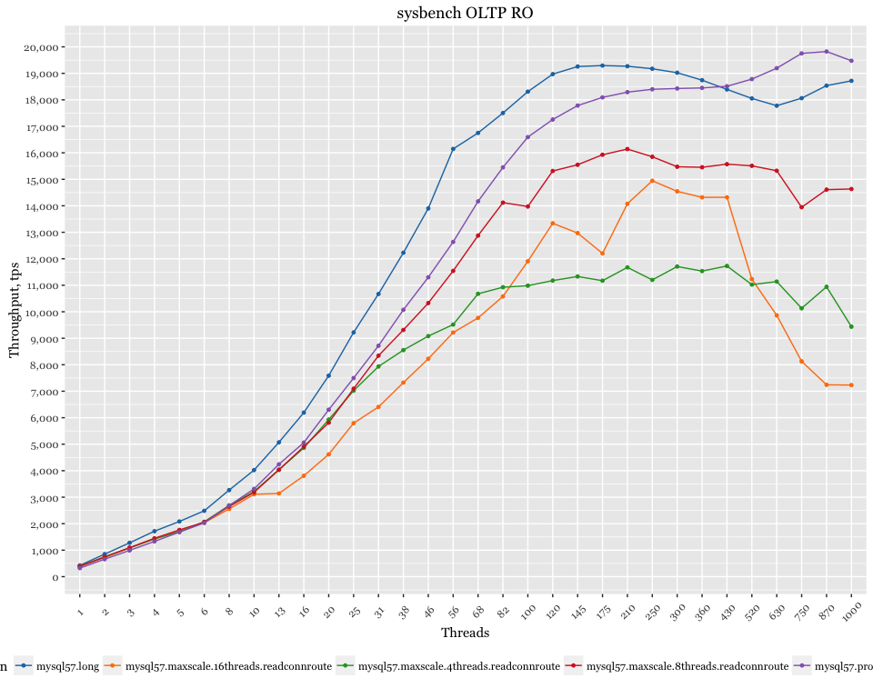

Percona Server 5.7 - proxy overhead
===================================

Setup
-----

-   Client (sysbench) and server are on the same server
-   CPU: 56 logical CPU threads servers Intel(R) Xeon(R) CPU E5-2683 v3 @ 2.00GHz
-   sysbench 10 tables x 10mln rows, pareto distribution
-   OS: Ubuntu 15.10 (Wily Werewolf)
-   Kernel 4.2.0-30-generic

Results with proxysql
---------------------

-   Vanilla MySQL 5.7
-   ProxySQL `mysql-threads=4`
-   ProxySQL `mysql-threads=16`

ProxySQL is running on the same host with sysbench, connected via unix-socket

### Relative performance

base value: MySQL 5.7

