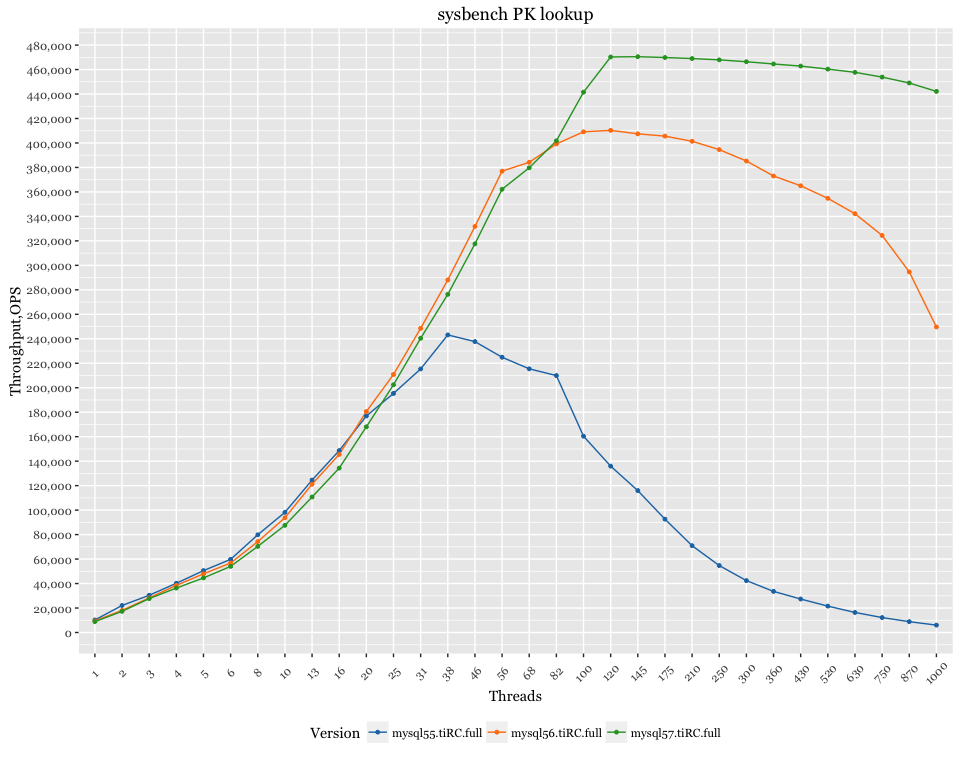
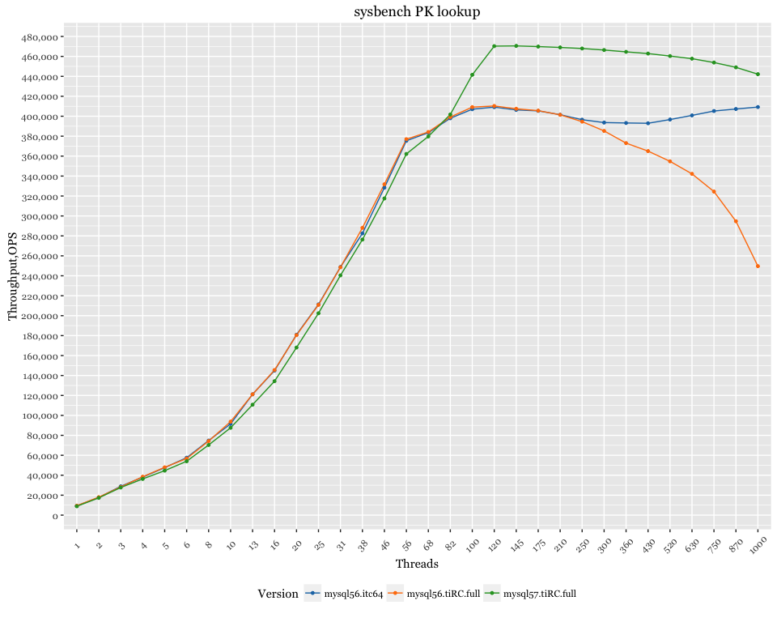

MySQL 5.5 / 5.6 / 5.7 - sysbench PK lookup queries in memory
============================================================

Setup
-----

-   Client (sysbench) and server are on different servers, connected via 10Gb network.
-   CPU for both: 56 logical CPU threads servers Intel(R) Xeon(R) CPU E5-2683 v3 @ 2.00GHz

MySQL 5.6 with thread\_concurrency
----------------------------------

-   MySQL 5.6 started with `--innodb-thread-concurrency=64`

Tabular format
--------------

|  Threads|  MySQL 5.5|  MySQL 5.6|  MySQL 5.7|
|--------:|----------:|----------:|----------:|
|        1|   10251.25|    9467.24|    8867.84|
|        2|   22089.38|   18051.90|   17294.30|
|        3|   30403.56|   28265.92|   27680.42|
|        4|   40214.19|   38505.39|   36306.56|
|        5|   50561.95|   47950.38|   44588.85|
|        6|   59758.43|   56762.94|   54020.72|
|        8|   79848.84|   74265.14|   70354.14|
|       10|   98186.69|   93750.08|   87571.39|
|       13|  124547.94|  121147.42|  110715.35|
|       16|  148634.50|  145494.95|  134311.88|
|       20|  176935.43|  180529.06|  168065.03|
|       25|  195344.00|  210845.18|  202430.81|
|       31|  215350.04|  248542.88|  240410.72|
|       38|  243174.13|  288092.30|  276309.37|
|       46|  237699.06|  331792.50|  317553.97|
|       56|  224913.19|  376976.09|  362192.68|
|       68|  215466.33|  384222.69|  379718.04|
|       82|  209943.41|  399189.40|  401762.99|
|      100|  160398.52|  409135.57|  441534.28|
|      120|  135941.76|  410300.52|  470287.24|
|      145|  115931.59|  407479.47|  470510.47|
|      175|   92624.35|  405598.97|  469839.37|
|      210|   70939.43|  401414.77|  468992.73|
|      250|   54710.35|  394564.75|  467929.02|
|      300|   42404.71|  385270.88|  466387.80|
|      360|   33596.82|  373034.49|  464568.64|
|      430|   27346.60|  365042.15|  462830.79|
|      520|   21560.59|  354766.91|  460353.36|
|      630|   16369.71|  342210.88|  457728.27|
|      750|   12216.13|  324451.11|  453843.38|
|      870|    8840.99|  294683.84|  449026.53|
|     1000|    6024.29|  249643.22|  442162.25|
