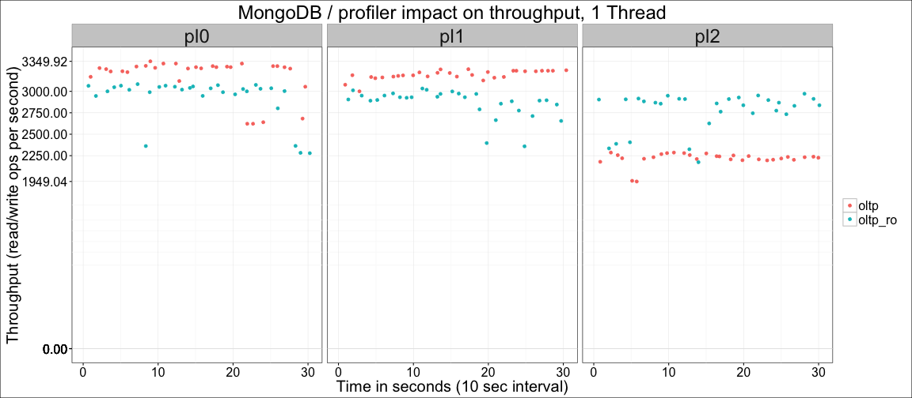
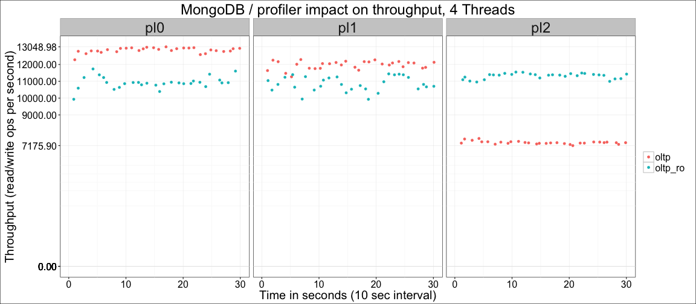
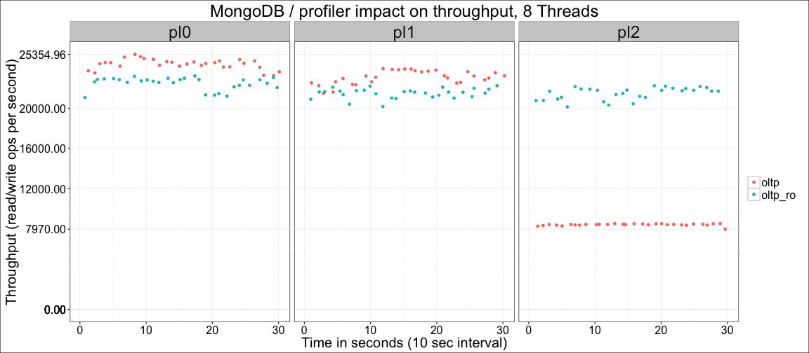
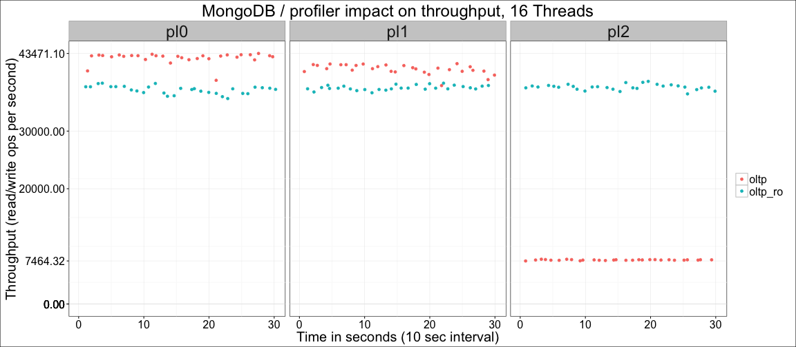
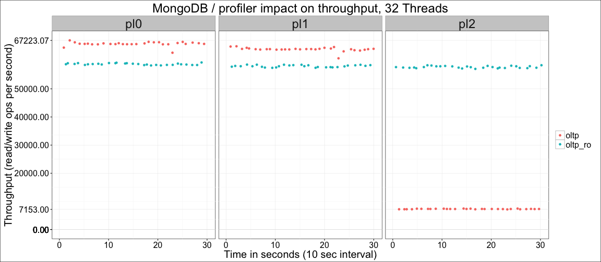
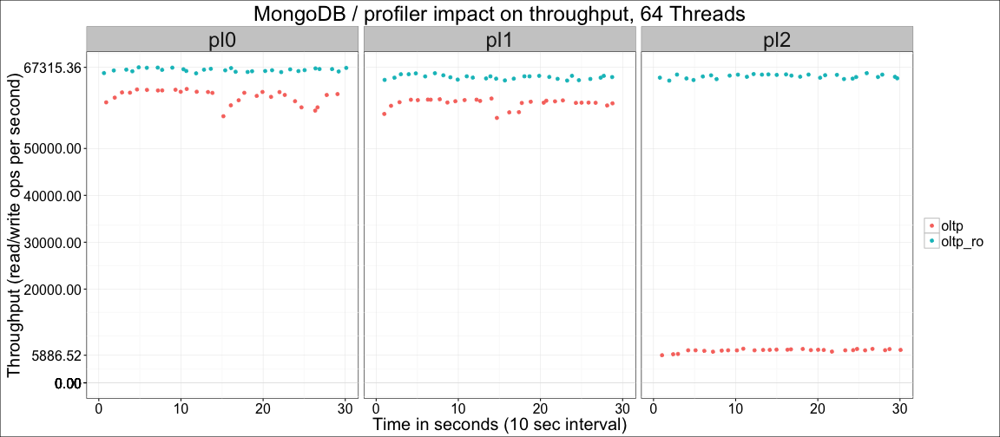
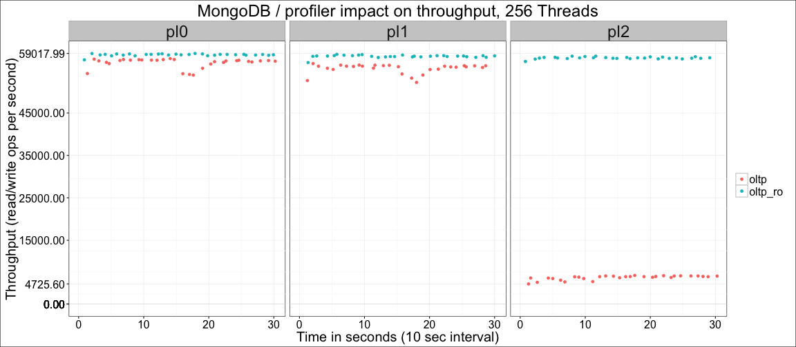

---

title: "MongoDB 3.2.4: Profiler impact on OLTP workloads"
author: "Percona Lab"
generated on:April 08, 2016
output:
  md_document:
    variant: markdown_github

---

# MongoDB 3.2.4 - Profiler impact 

## Setup

* Client (sysbench) and server are on the same machine
* CPU: 48 logical CPU threads servers Intel(R) Xeon(R) CPU E5-2680 v3 @ 2.50GHz
* 128GB RAM (64GB storage engine cache)
* sysbench with mongodb support, 16 collections x 2M documents (~6GB compressed), uniform distribution. 
* Profiler disabled (--profile=0) or enabled for all queries (--profile=2), represented respectively as pl0 and pl2 on the graphs
* WiredTiger storage engine

## Throughput by workload and profiler setting 

