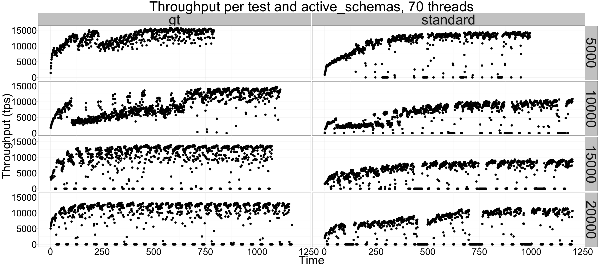
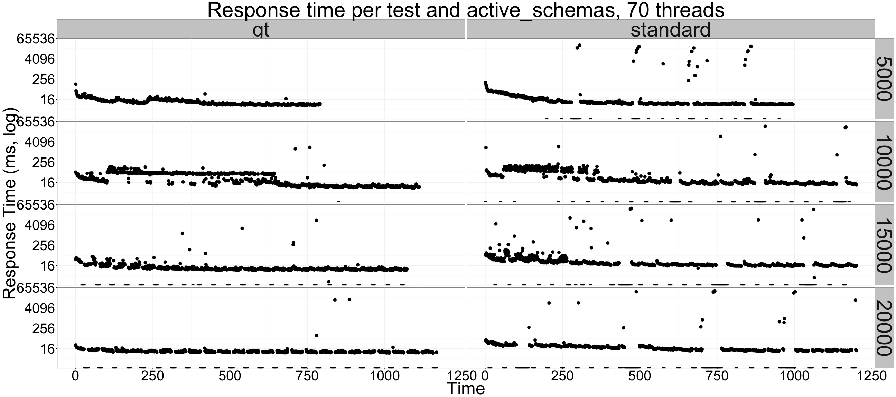

---

title: "MySQL Community Server 5.7: General Tablespaces performance"
author: "Percona Lab"
generated on:August 30, 2016
output:
  md_document:
    variant: markdown_github

---

# MySQL Community Edition 5.7.13: General Tablespaces performance 

## Setup

* Client and server on the same machine 
* Client sofwware is sysbench, 70 active threads, 20k active schemas, 40k schemas in total.
* CPU: 48 logical CPU threads (Intel(R) Xeon(R) CPU E5-2680 v3 @ 2.50GHz). 
* Memory: 100GB Buffer Pool. 130GB RAM.
* Disk: Intel 3600 nvme
* Standard test: innodb_file_per_table. 
data
* GT test: one general tablespace per schema. 

## Results

