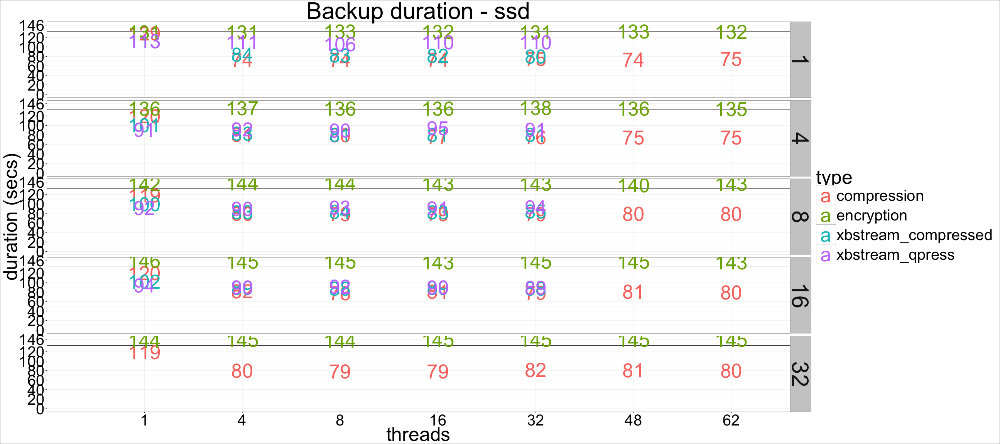
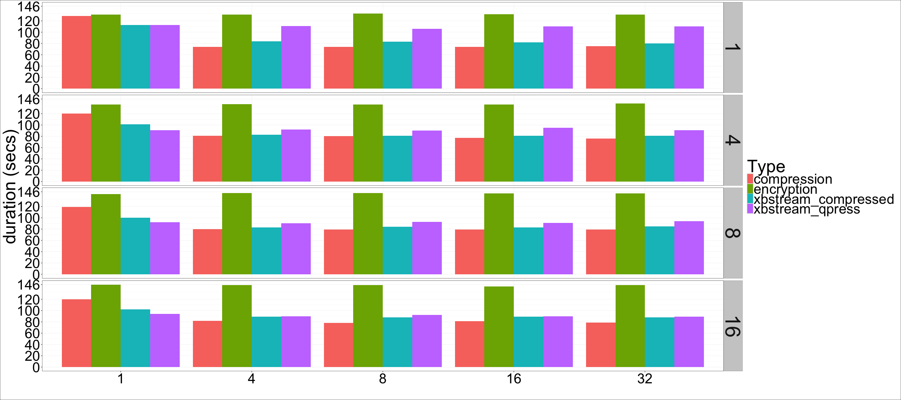

---

title: "Percona Xtrabackup: Compression and Encryption performance"
author: "Percona Lab"
generated on:August 01, 2016
output:
  html_document:
    self_contained: false 
    lib_dir: libs
<!--  md_document:
    variant: markdown_github -->

---

# Percona Xtrabackup 2.3.4 - Encryption and Compression performance 

## Setup

* Client and server on the same machine 
* Sysbench oltp workload running during all tests
* 21GB datadir (restored between tests)
* CPU: 48 logical CPU threads (Intel(R) Xeon(R) CPU E5-2680 v3 @ 2.50GHz). 
* Memory: 120GB. 
* Disk: hdd (HGST HUH728080ALE600), ssd (Intel 3600 nvme) 
* Encryption (E) and Compression (C) tested with 1, 4, 8, 16 and 32 threads

## Backup duration 

Backup duration by type, number of threads, and disk type, faceted by
--parallel threads. The
horizontal line on each graph shows the duration for the baseline (non
compressed, non encrypted) backup. 

