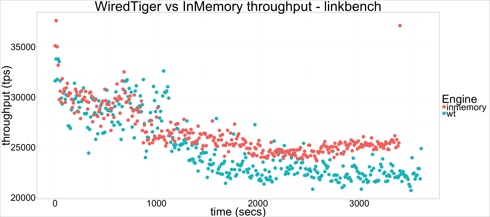

---

title: "Percona Server for MongoDB 3.2.7: WiredTiger vs InMemory linkbench performance"

author: "Percona Lab"
generated on:September 06, 2016
output:
  md_document:
    variant: markdown_github

---

# Percona Server for MongoDB 3.2.7-1.1 - WiredTiger vs InMemory linkbench performance

## Setup

* WiredTiger: psmdb 3.2.7-1.1 
* InMemory: built from source, v3.2 percona-server-mongodb branch
* linkbenchX with default workload, 100 threads, 5000000 nodes, 22650508 links (8GB datadir) 
* inMemorySizeGB / wiredTigerCacheSizeGB set to 32GB

