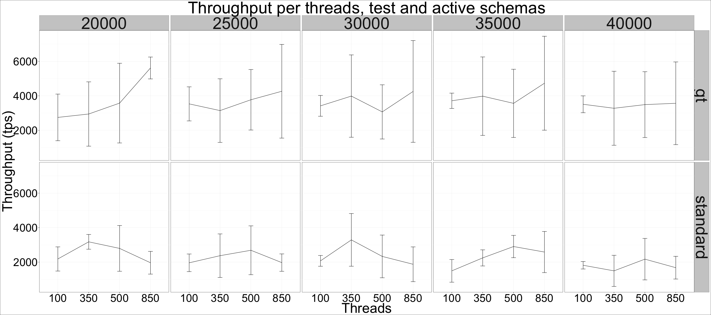

# Percona Server for MongoDB 3.0.8-1.2 - data set that fits in RAM 

## Setup

* Client (sysbench) and server are on the same machine
* CPU: 48 logical CPU threads servers Intel(R) Xeon(R) CPU E5-2680 v3 @ 2.50GHz
* sysbench with mongodb support, 16 collections x 2M documents, uniform distribution. 

## Throughput per threads and workload (ro/rw), for all engines 

