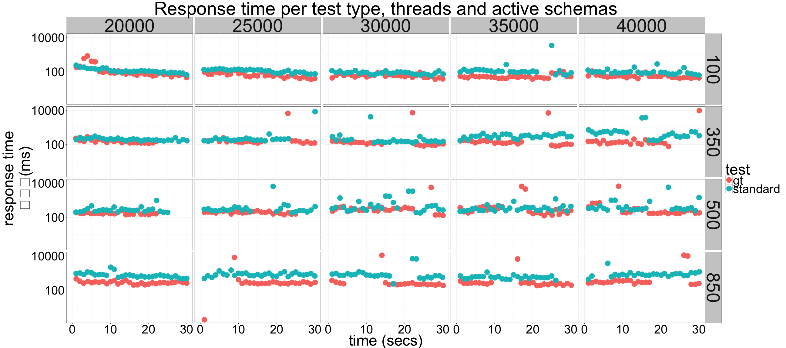
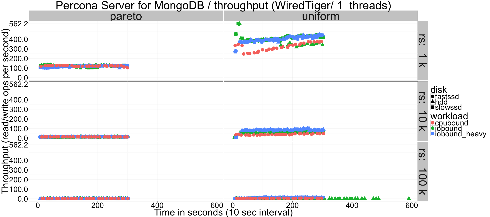
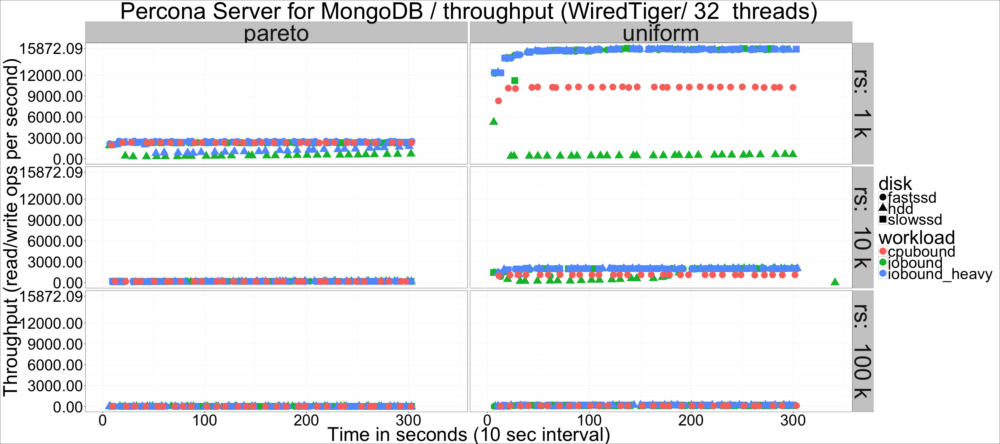
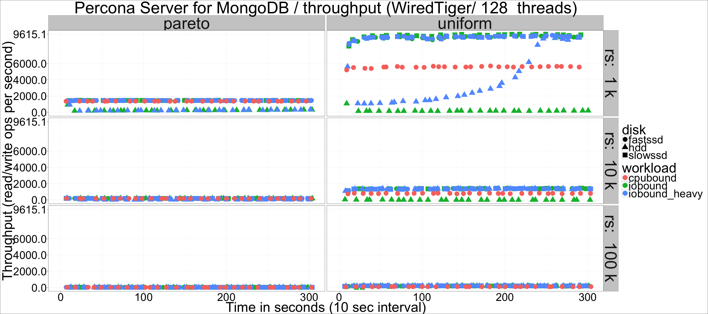
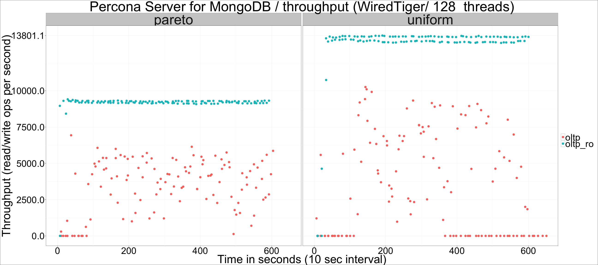
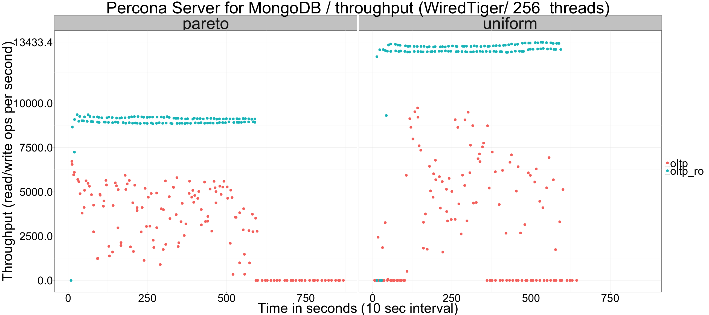
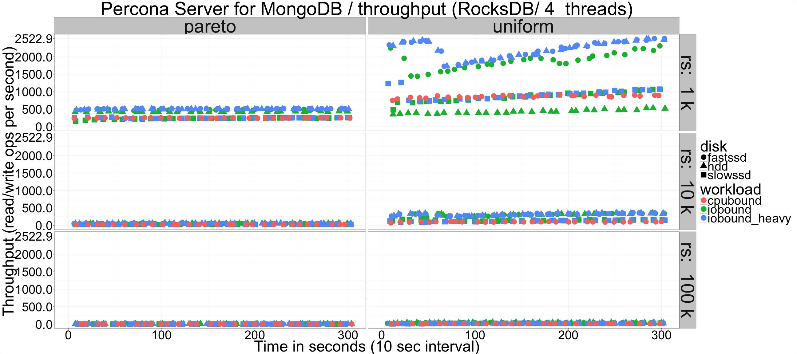
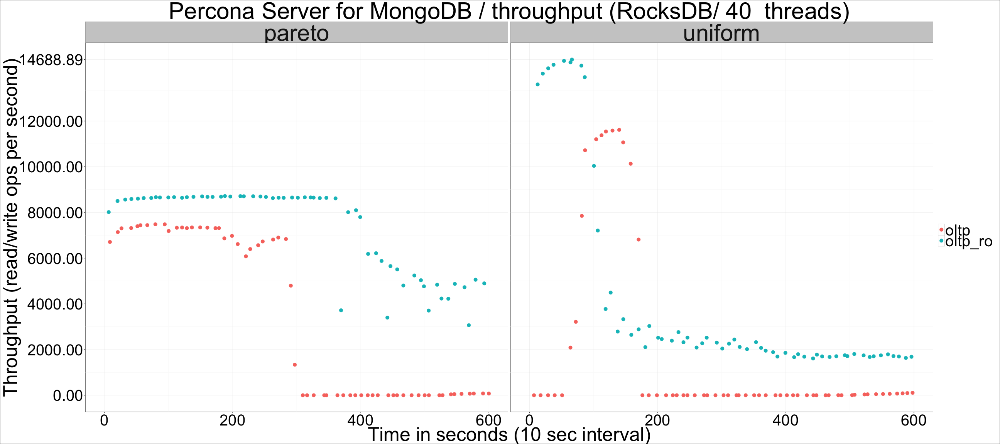
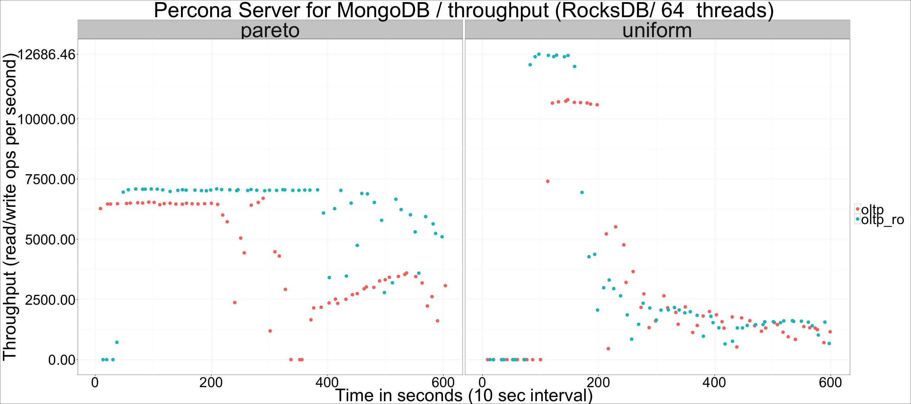
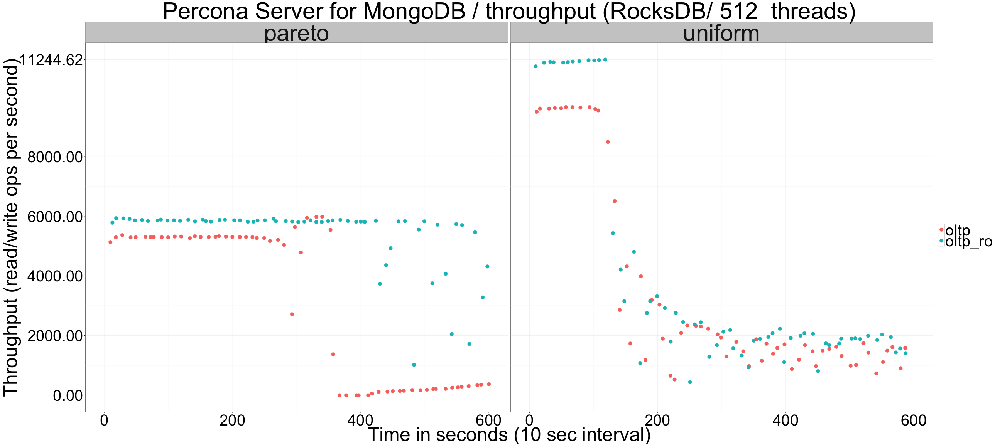

---

title: "Percona Server for MongoDB: Storage Engine comparison"
author: "Percona Lab"
generated on:April 24, 2016
output:
  md_document:
    variant: markdown_github

---


# Percona Server for MongoDB 3.2.0-1.0 - data that does not fit in RAM 

## Setup

* Client (sysbench) and server are on the same machine
* CPU: 48 logical CPU threads servers Intel(R) Xeon(R) CPU E5-2680 v3 @ 2.50GHz
* 12GB RAM (limited via cgroup)
* sysbench with mongodb support, 16 collections x 10m documents (~30G compressed), uniform and pareto distributions. 

## Throughput per threads and workload



## Throughput per threads and workload, summary for engine


```
## Error: Faceting variables must have at least one value
```


## Throughput per threads and workload, details. 
## Throughput per threads and workload, PerconaFT


```
## Error: Faceting variables must have at least one value
```


## Throughput per threads and workload, WiredTiger



## Throughput per threads and workload, RocksDB


