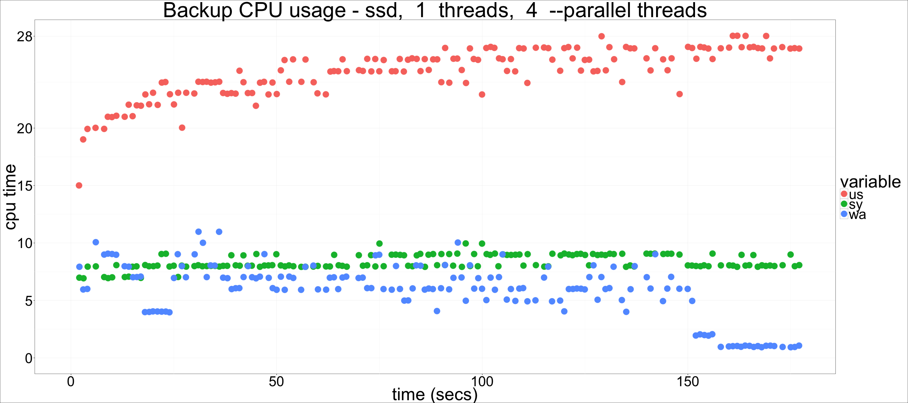
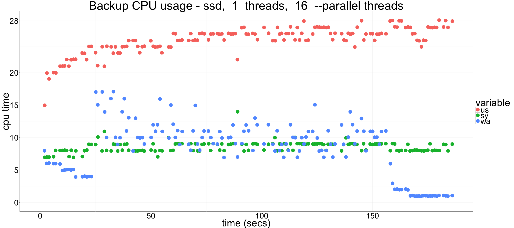
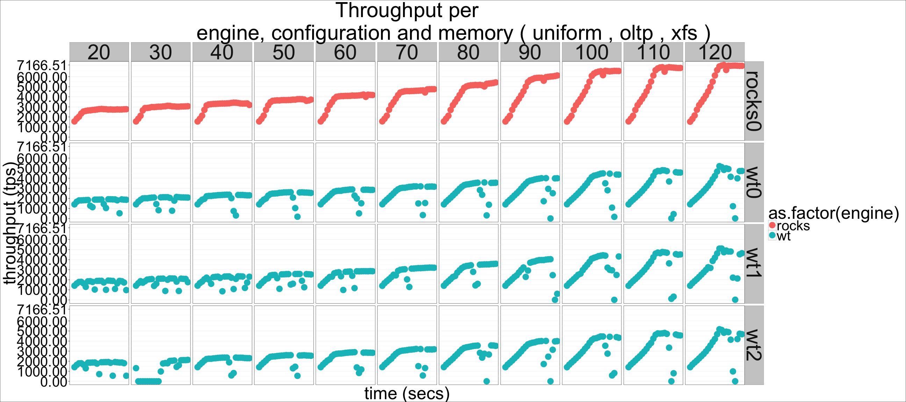
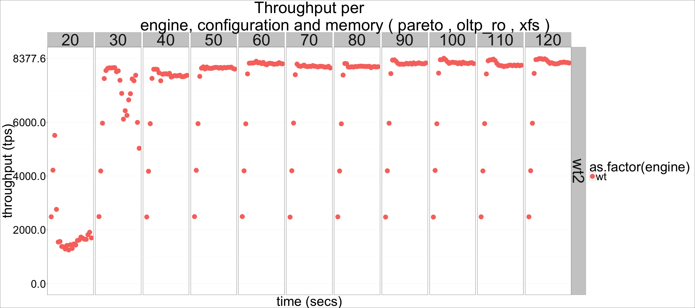

---

title: "Percona Server for MongoDB: CPU and I/O scalability for
WiredTiger and RocksDB"
author: "Percona Lab"
generated on:May 29, 2016
output:
  md_document:
    variant: markdown_github

---

# Percona Server for MongoDB 3.2.4-1.rc2 - CPU and I/O scalability 

## Setup

* Setup information pending 

## CPU Scalability tests 

## Memory Scalability tests

The memory scalability tests were all done using 100 client threads.
All graphs faceted by memory and configuration. 

