---

title: "Percona Server for MongoDB: CPU and I/O scalability for
WiredTiger and RocksDB"
author: "Percona Lab"
generated on:June 04, 2016
output:
  md_document:
    variant: markdown_github

---

# Percona Server for MongoDB 3.2.4-1.rc2 - I/O scalability 

## Setup

* Setup information pending 

## Memory Scalability tests

## Disk ops 

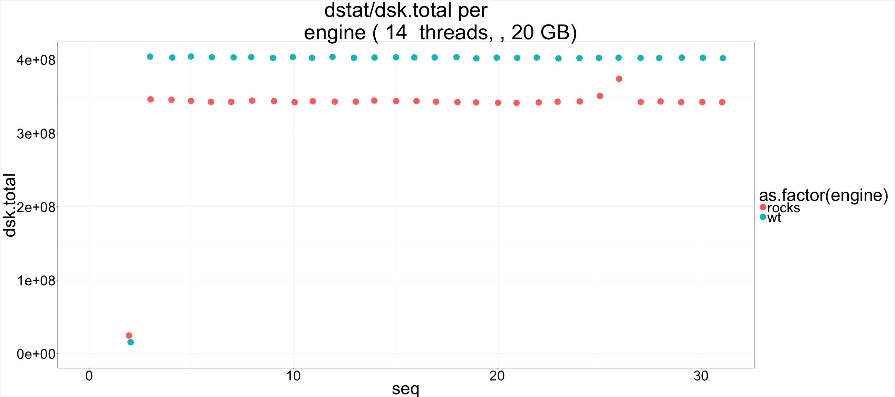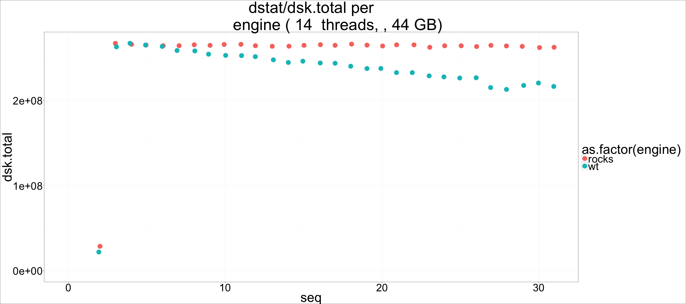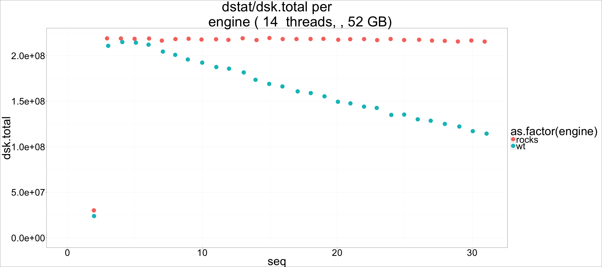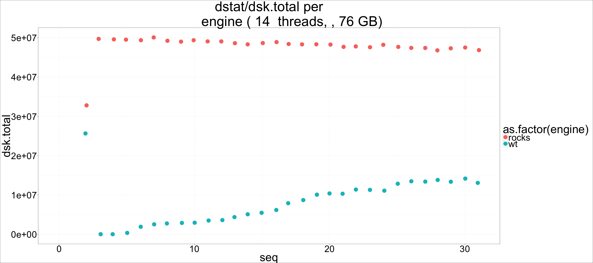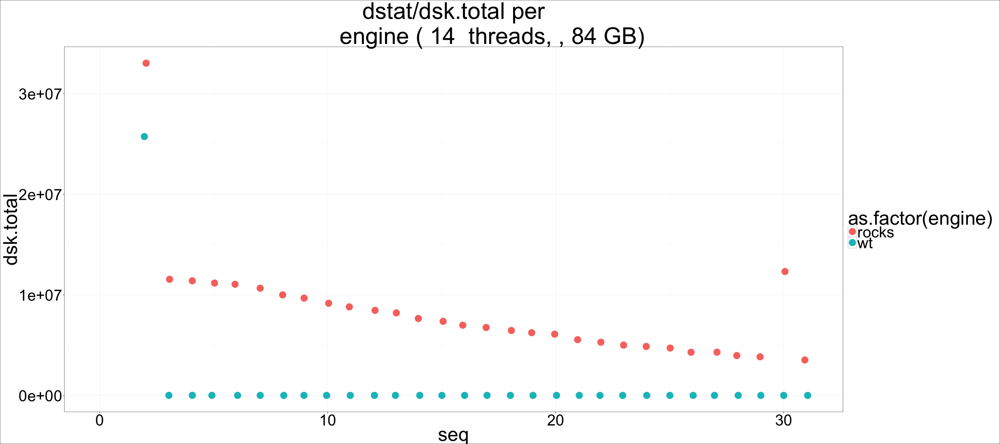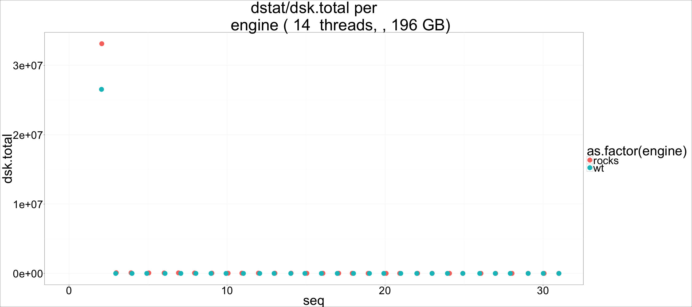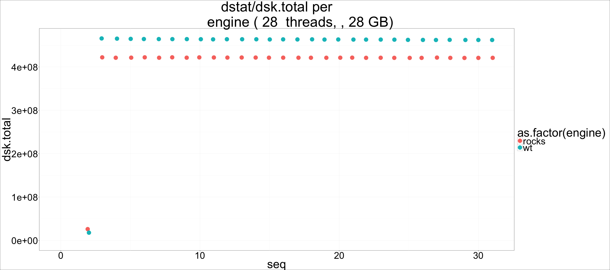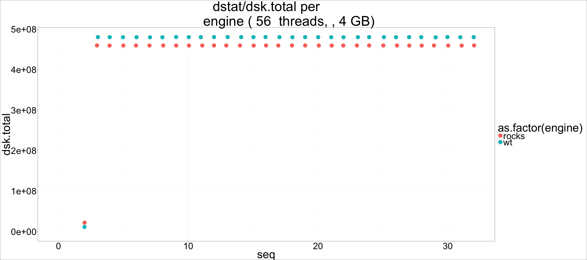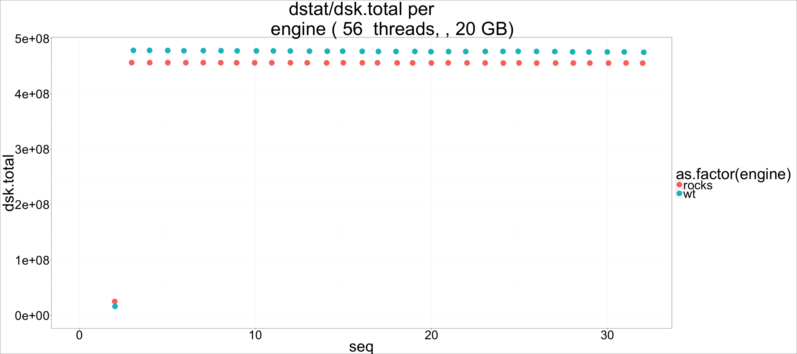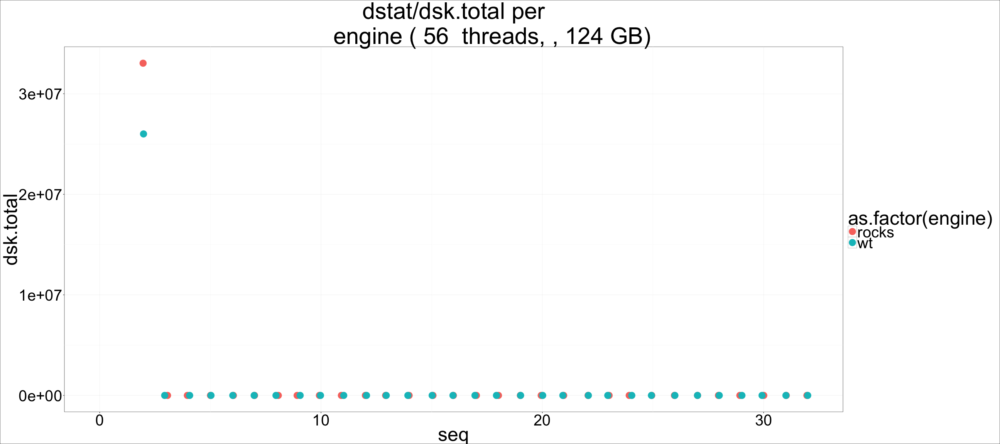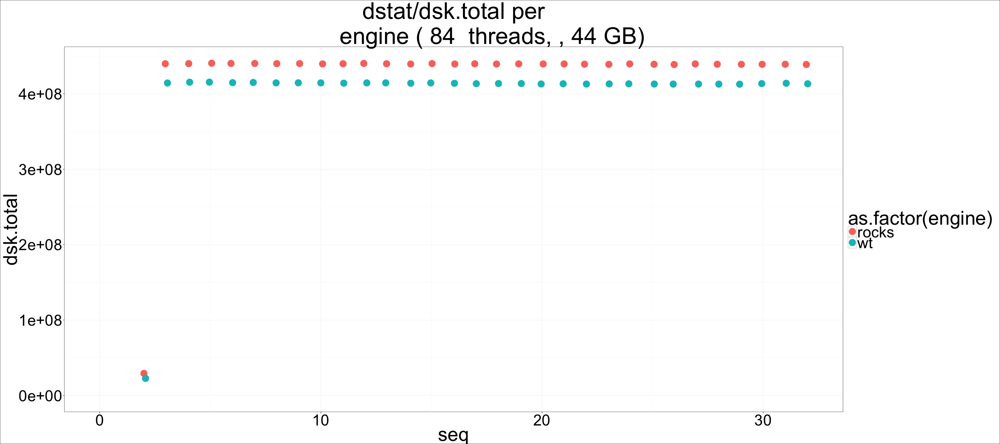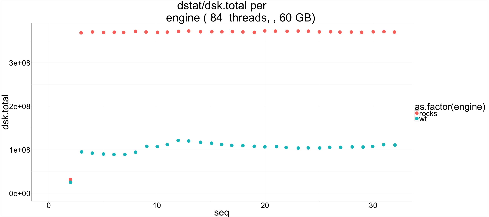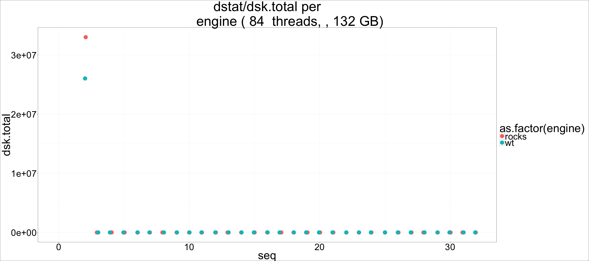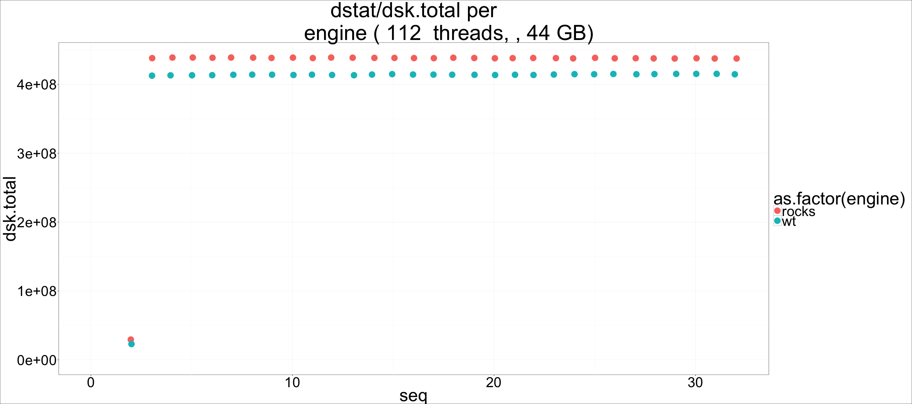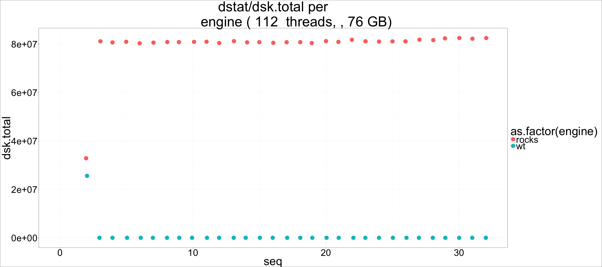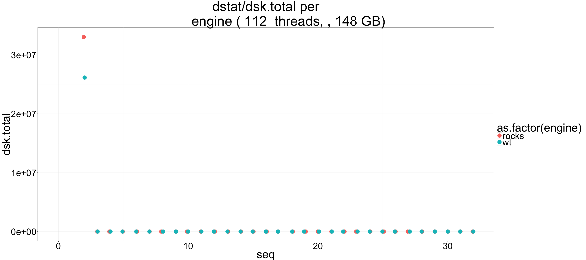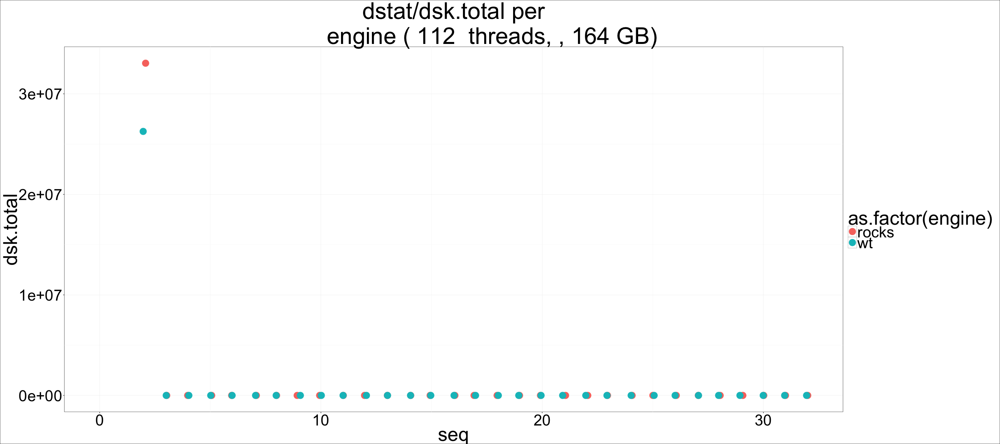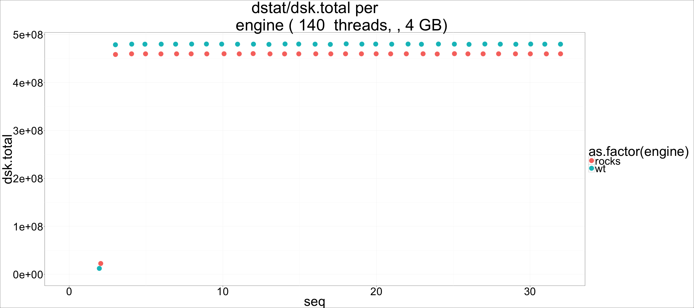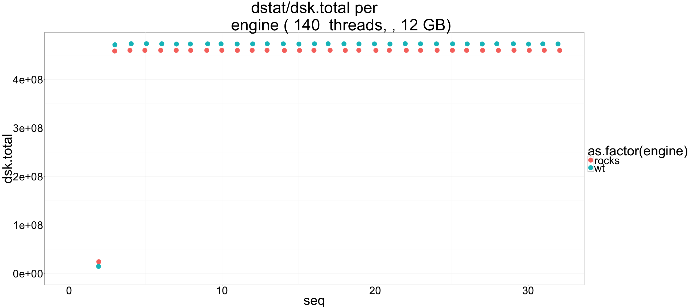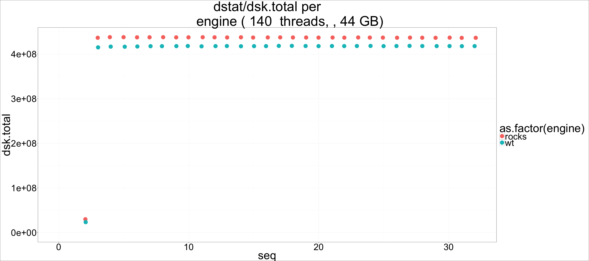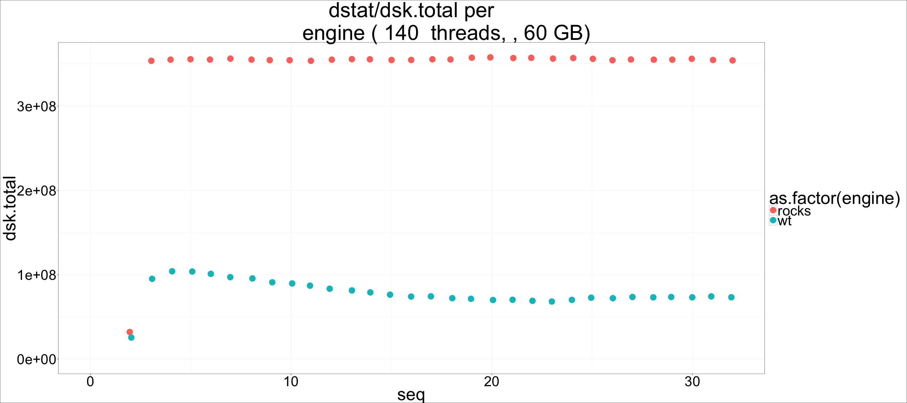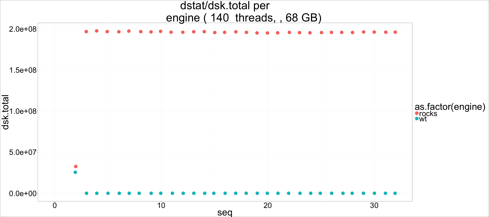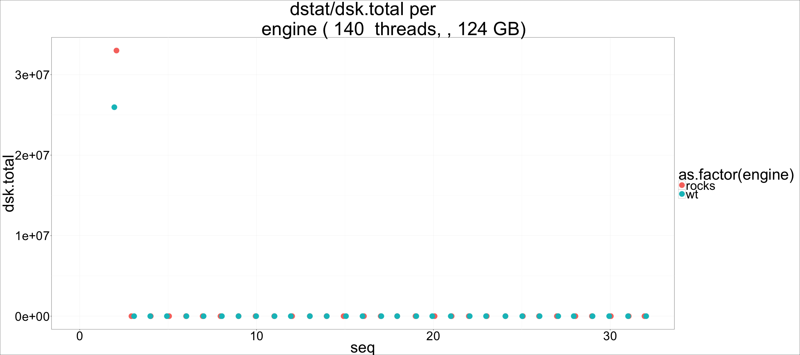

