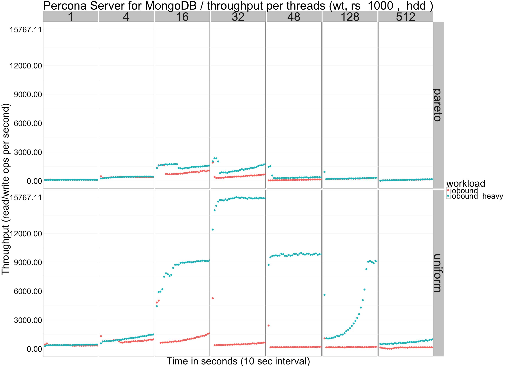
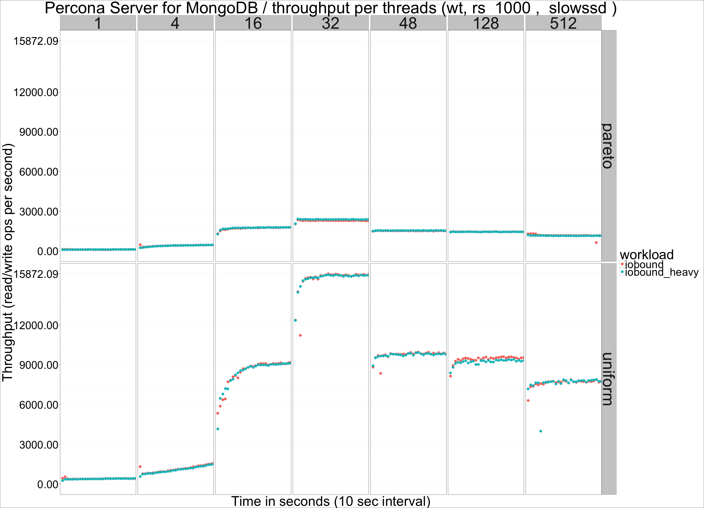
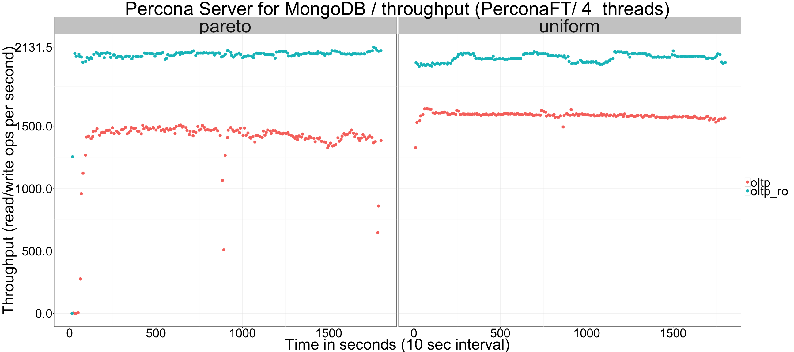
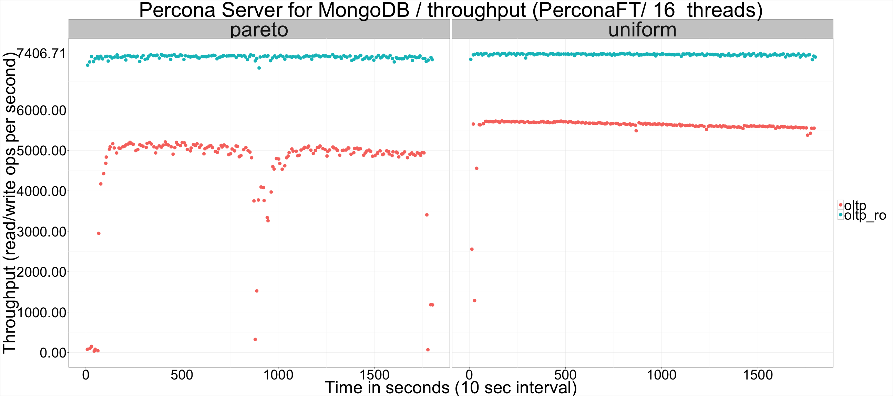
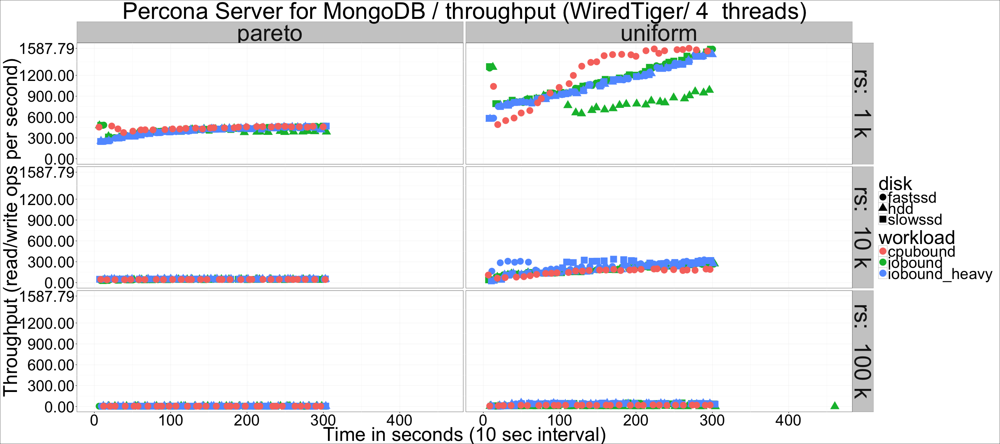
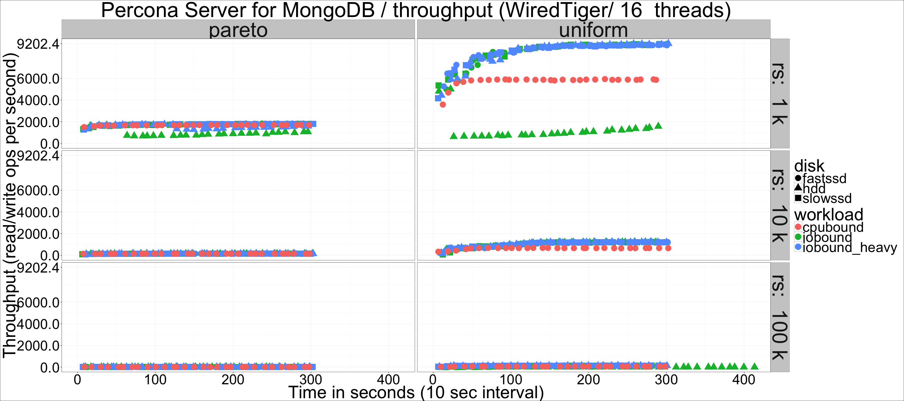
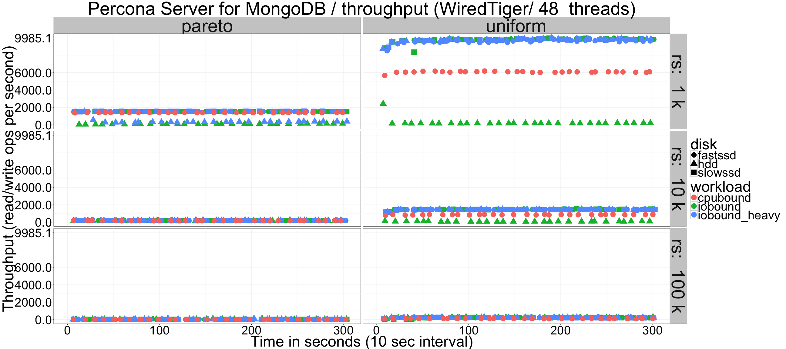
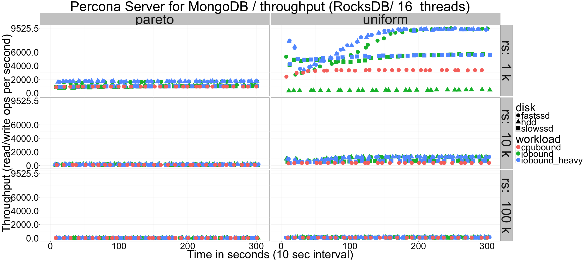
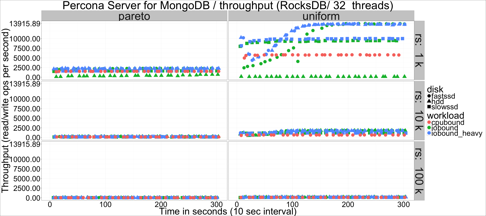
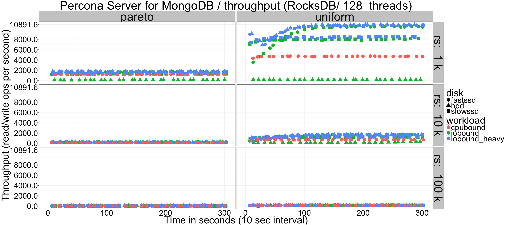

---

title: "Percona Server for MongoDB: Storage Engine comparison"
author: "Percona Lab"
generated on:May 06, 2016
output:
  md_document:
    variant: markdown_github

---

# Percona Server for MongoDB 3.2.0-1.0 - data that does not fit in RAM 

## Setup

* Client and server on different (equal) machines.
* Client sofwware is sysbench (https://github.com/Percona-Lab/sysbench/tree/dev-mongodb-support).
* CPU: 56 logical CPU threads (Intel(R) Xeon(R) CPU E5-2683 v3 @ 2.00GHz).
* 20GB RAM (limited via cgroup).
* sysbench with mongodb support, 16 collections x 60M documents (~50G uncompressed), uniform and pareto distributions. 

## Throughput per threads and workload

## Throughput per threads and workload, summary for engine

## Throughput per threads and workload, details. 
## Throughput per threads and workload, PerconaFT

## Throughput per threads and workload, WiredTiger

## Throughput per threads and workload, RocksDB

