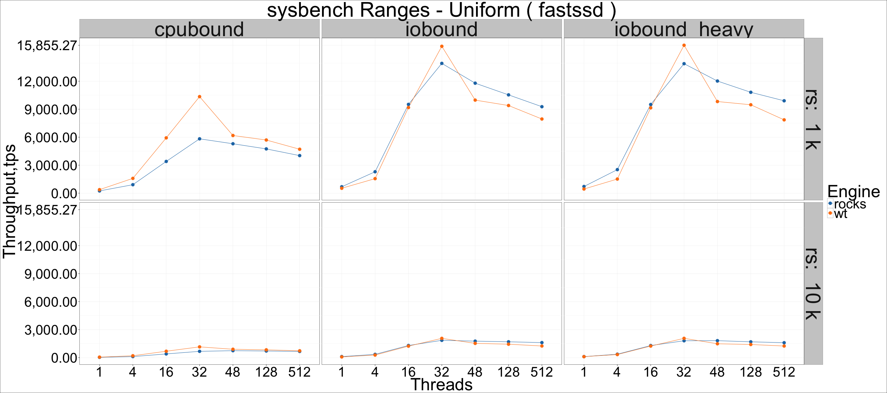
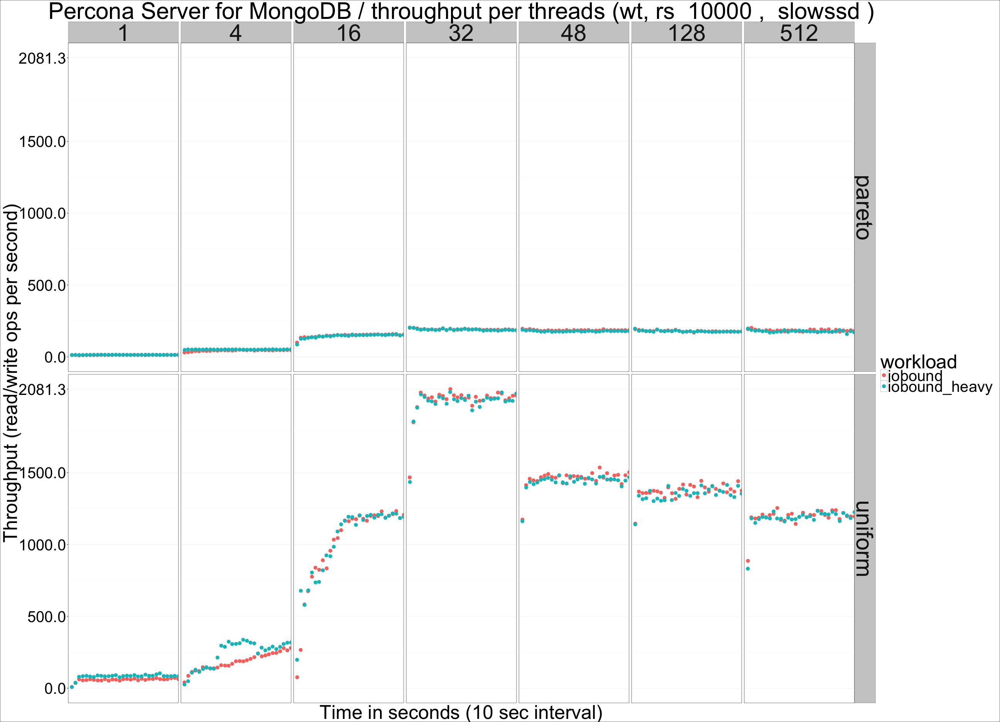
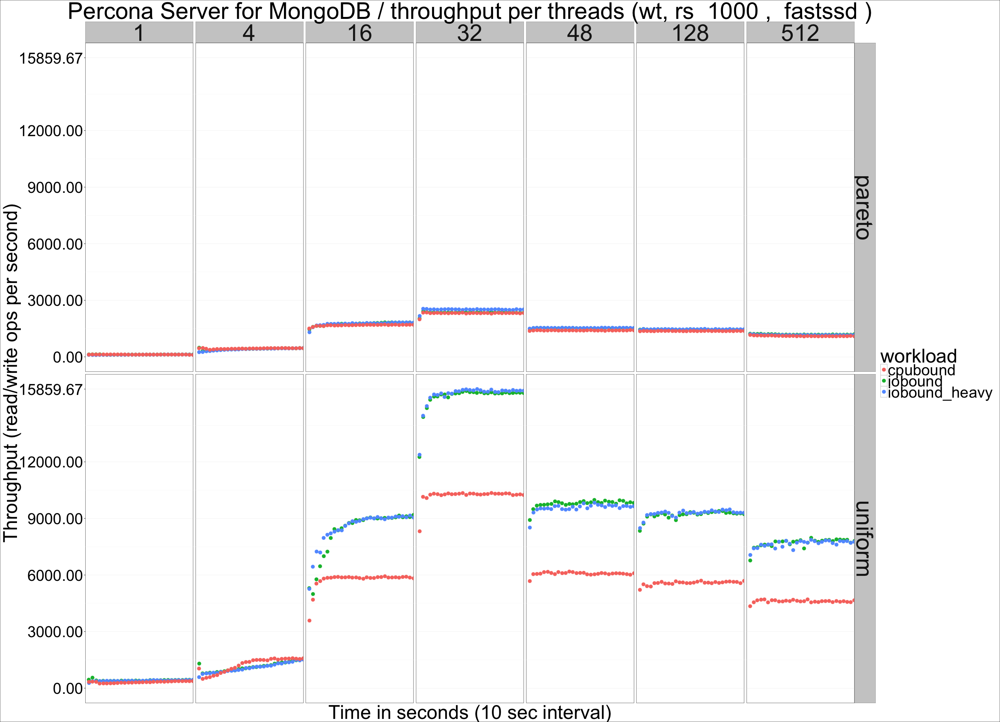
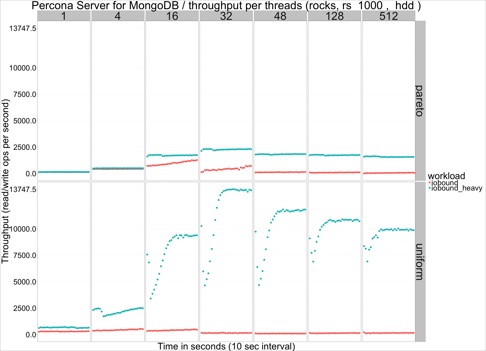
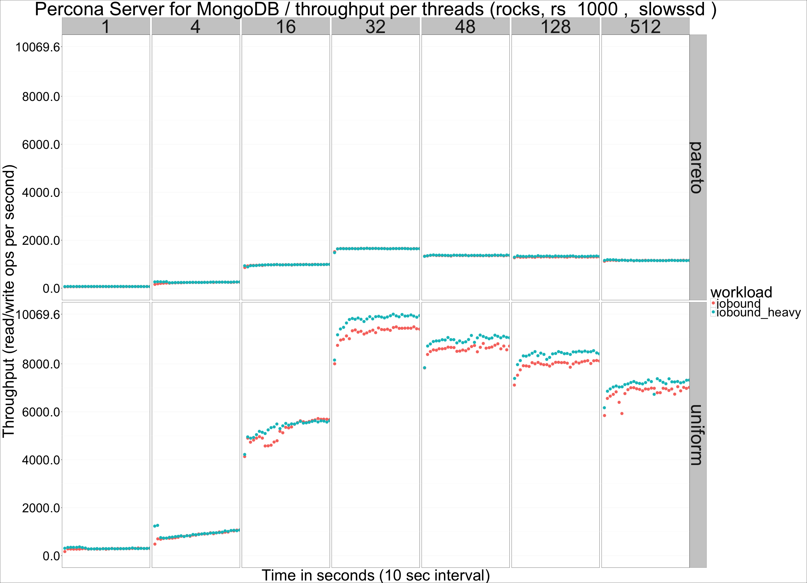
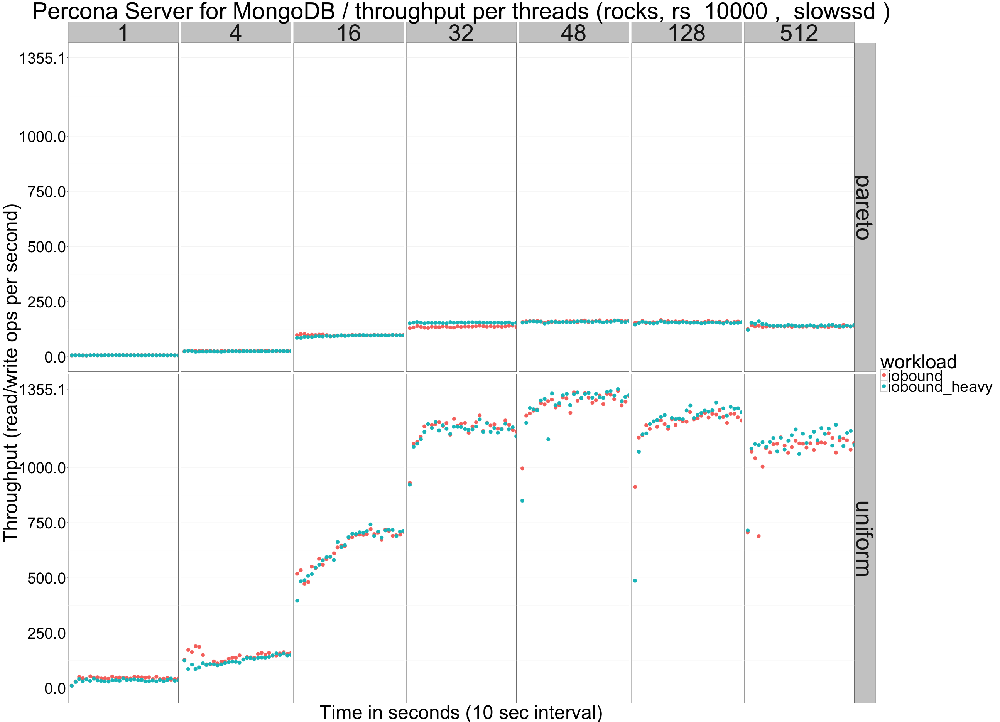
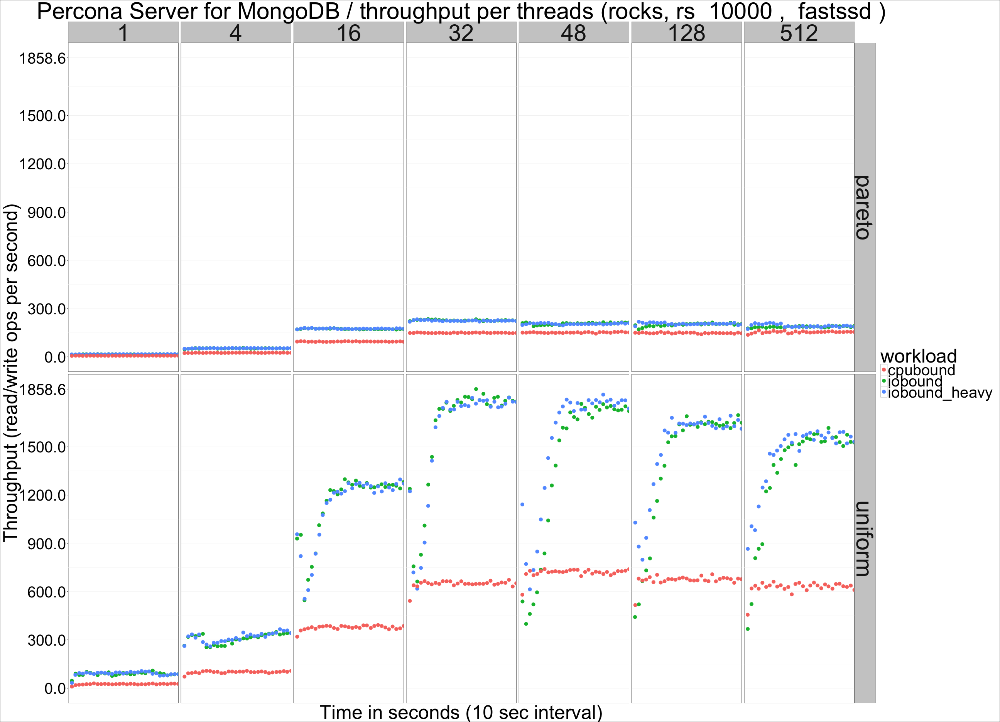
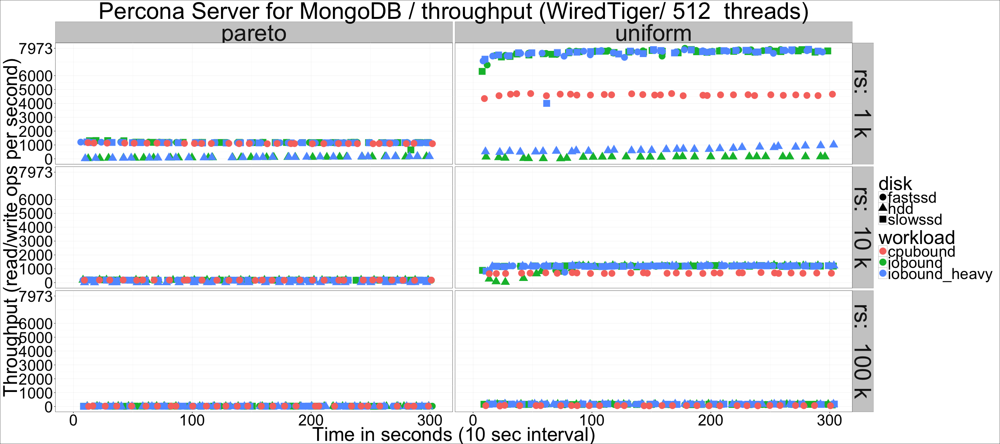
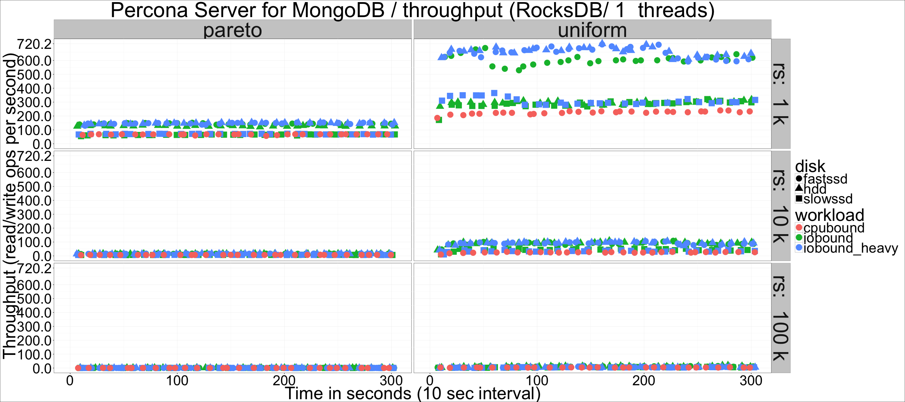

---

title: "Percona Server for MongoDB: Range Queries performance on RocksDB and WiredTiger"
author: "Percona Lab"
generated on:May 15, 2016
output:
  md_document:
    variant: markdown_github

---

# Percona Server for MongoDB 3.2.0-1.0 - Range queries performance 

## Setup

* Client and server on the same machine 
* Client sofwware is sysbench (https://github.com/Percona-Lab/sysbench/tree/dev-mongodb-support).
* CPU: 48 logical CPU threads (Intel(R) Xeon(R) CPU E5-2680 v3 @ 2.50GHz). 
* Memory: 120GB or 20GB (the latter limited via cgroup).
* Disk: hdd (HGST HUH728080ALE600), slowssd (Crucial CT960M500SSD1), fastssd (Intel 3600 nvme) 
* sysbench with mongodb support, 16 collections x 10M or 60M documents (~35GB or ~200G uncompressed), uniform and pareto distributions. 
* Workloads are labeled as:
- cpubound (10M documents per collection, fastssd storage)
- iobound (60M documents per collection, fastssd and slowssd storage, 120GB RAM)
- iobound_heavy (same as previous, but with 20GB RAM)

## Throughput per threads and workload

## Throughput per threads and workload, summary per engine

## Throughput per threads and workload, details. 
## Throughput per threads and workload, WiredTiger

## Throughput per threads and workload, RocksDB

