---

title: "Percona Server for MongoDB: CPU and I/O scalability for
WiredTiger and RocksDB"
author: "Percona Lab"
generated on:June 03, 2016
output:
  md_document:
    variant: markdown_github

---

# Percona Server for MongoDB 3.2.4-1.rc2 - CPU and I/O scalability 

## Configuration reference

### rocks0

storage.rocksdb.configString:
"bytes_per_sync=16m;max_background_flushes=3;max_background_compactions=12;max_write_buffer_number=4;max_bytes_for_level_base=1500m;target_file_size_base=200m;level0_slowdown_writes_trigger=12;write_buffer_size=400m;compression_per_level=kSnappyCompression:kSnappyCompression:kSnappyCompression:kSnappyCompression:kSnappyCompression:kSnappyCompression:kSnappyCompression;optimize_filters_for_hits=true"

### wt0

--syncdelay=900 --wiredTigerJournalCompressor=none --wiredTigerCacheSizeGB=$cache_size

### wt1

--syncdelay=900 --wiredTigerJournalCompressor=zlib --wiredTigerCacheSizeGB=$cache_size

### wt2

--syncdelay=900 --wiredTigerJournalCompressor=snappy --wiredTigerCacheSizeGB=$cache_size

## Memory Scalability tests

The memory scalability tests were all done using 100 client threads.
All graphs faceted by memory and configuration. 

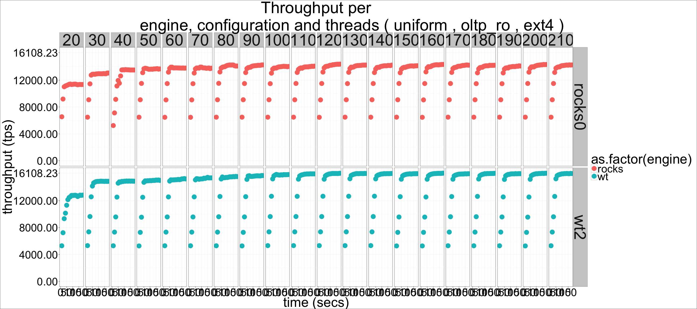

## Throughput detail 

### Memory scalability

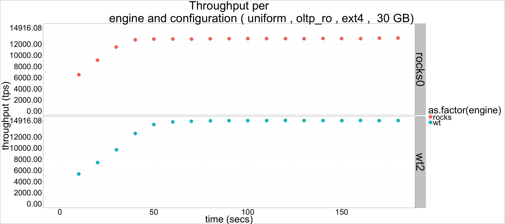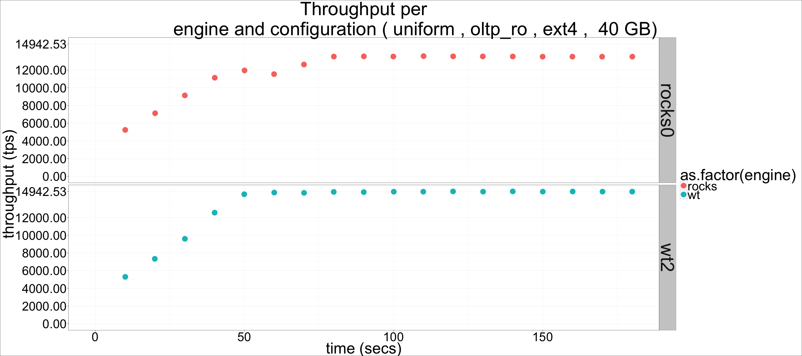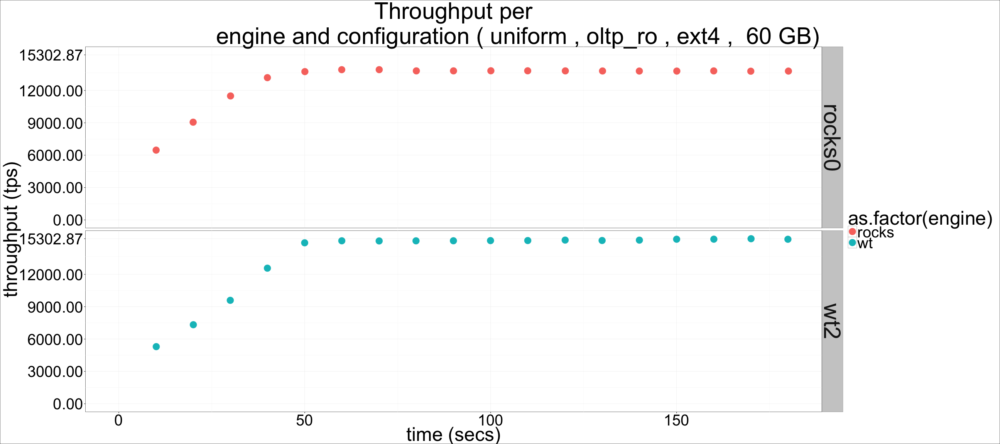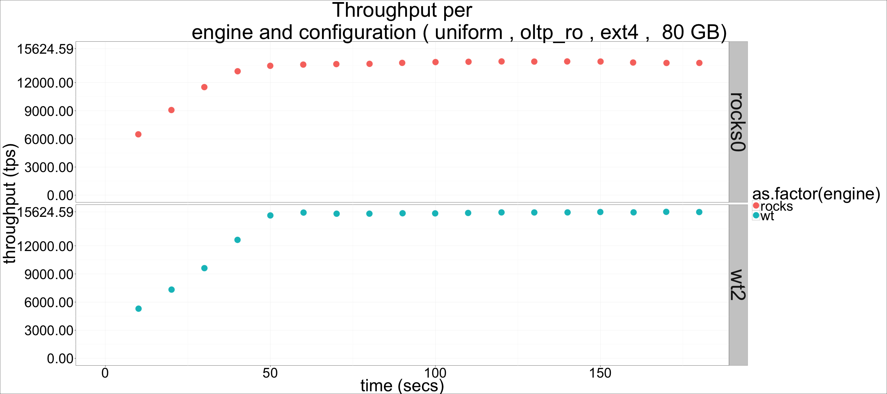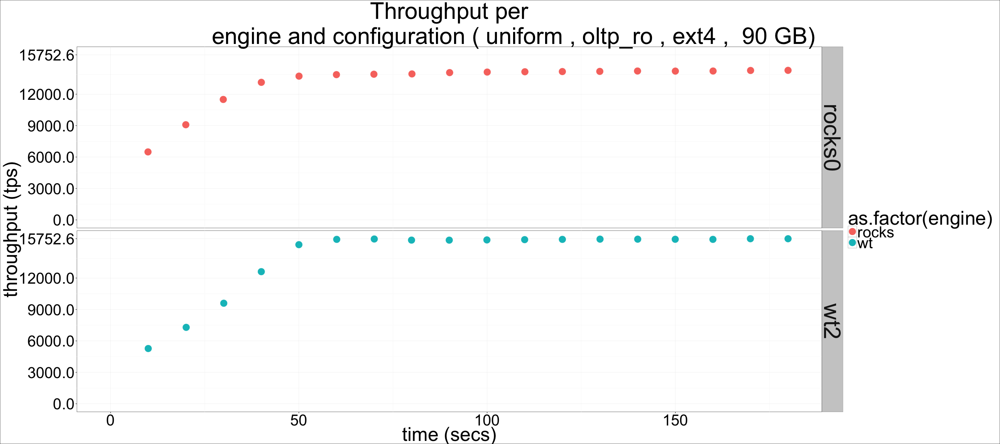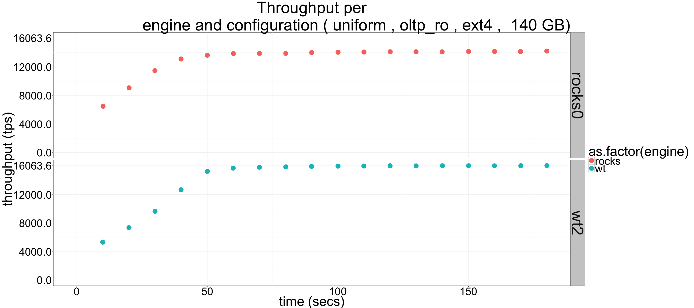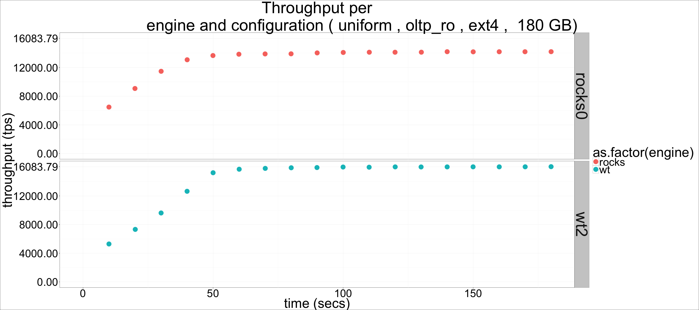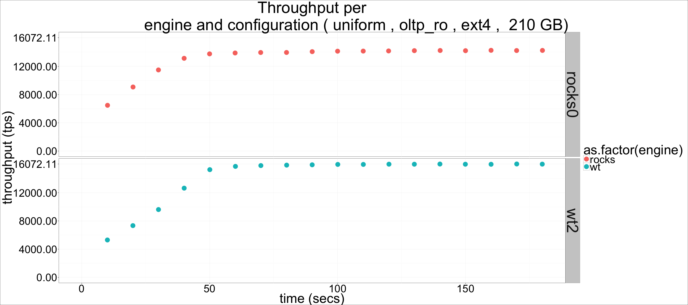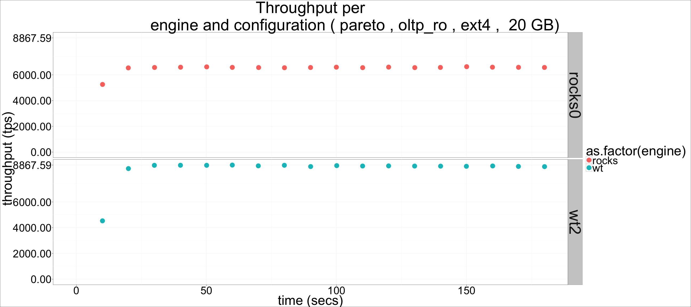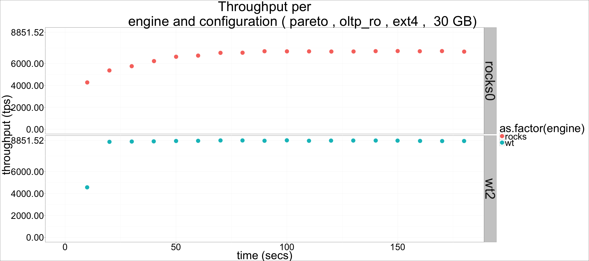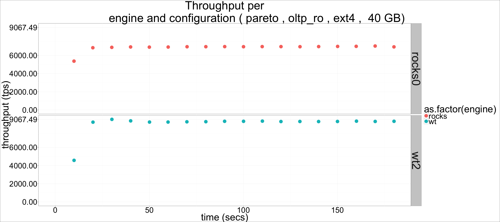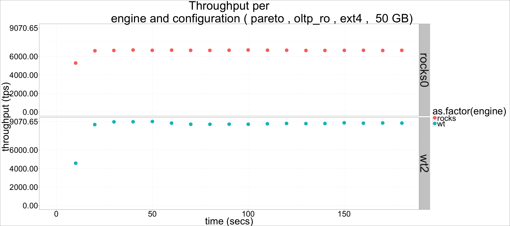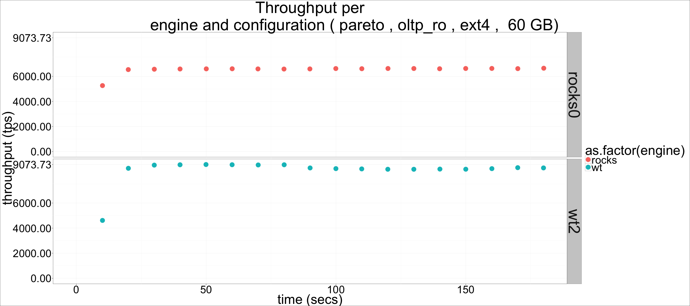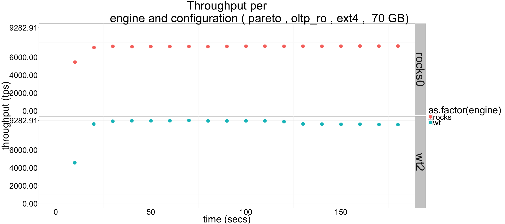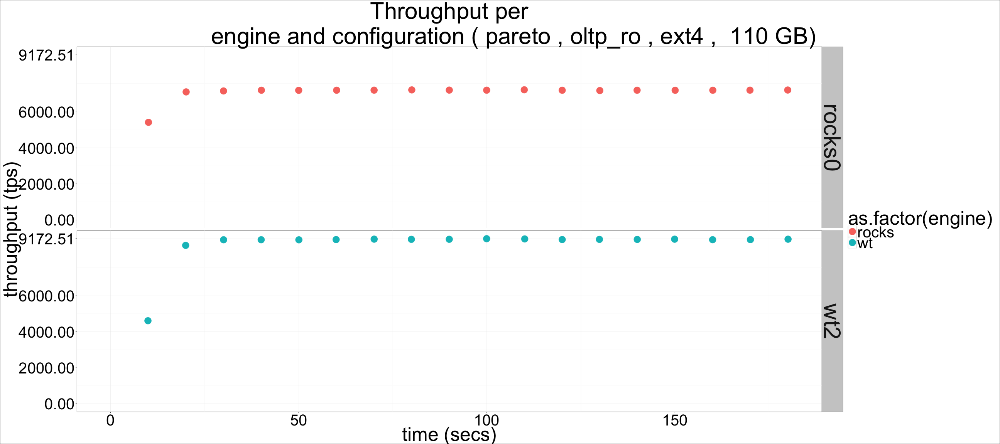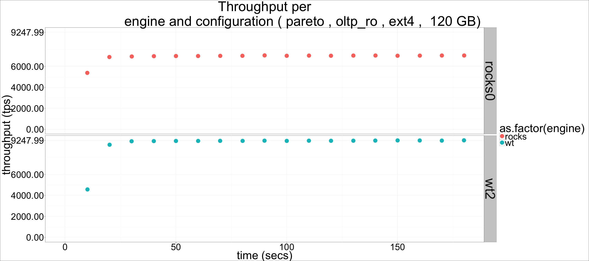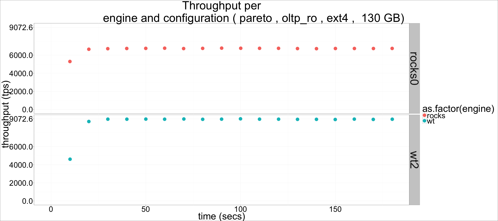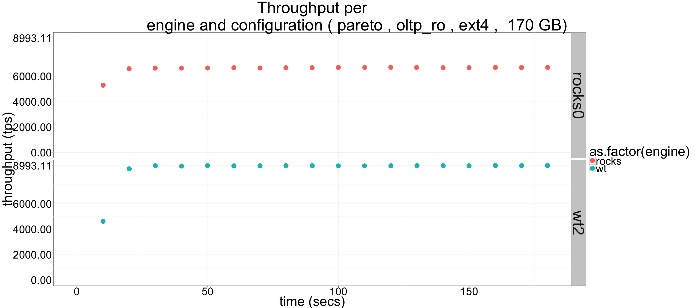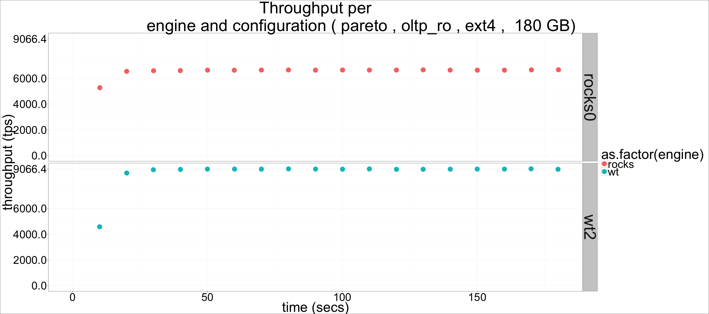

