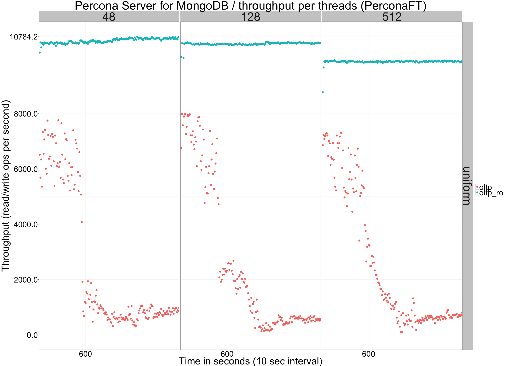
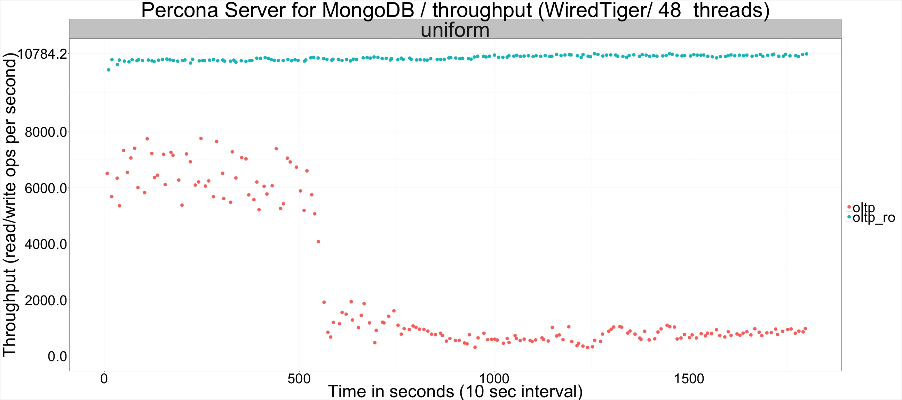
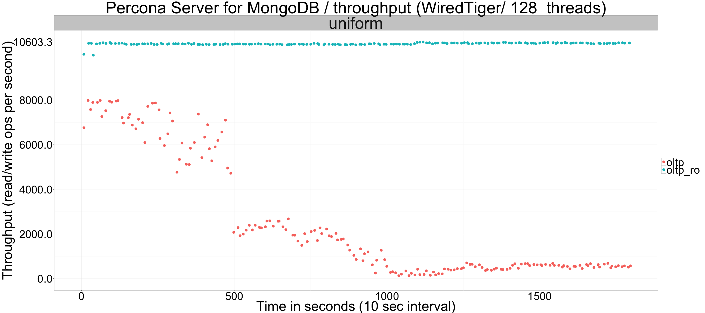
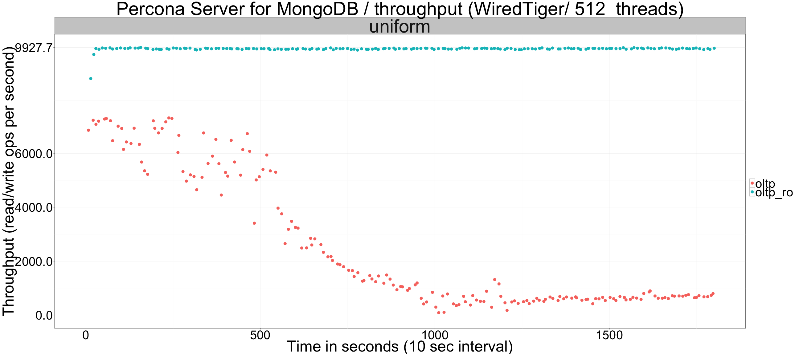

---

title: "Percona Server for MongoDB: Storage Engine comparison (WiredTiger reruns)"
author: "Percona Lab"
generated on:May 09, 2016
output:
  md_document:
    variant: markdown_github

---

# Percona Server for MongoDB 3.2.0-1.0 - data that does not fit in RAM 

## WiredTiger reruns

These were obtained by running the same benchmark, with the following changes to WiredTiger's configuration:
- No compression for journal
- syncdelay set to 900

## Throughput per threads and workload, WiredTiger 

## Throughput per threads and workload, WiredTiger

