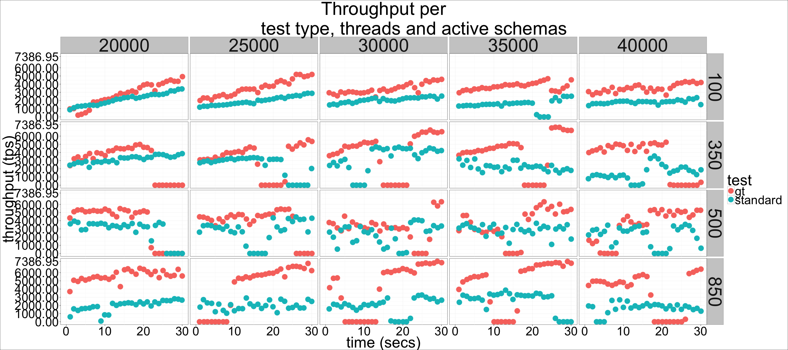
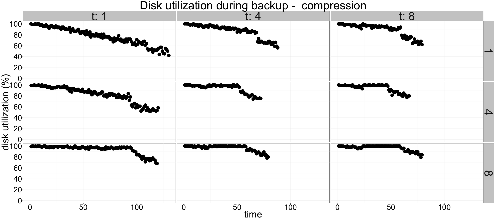
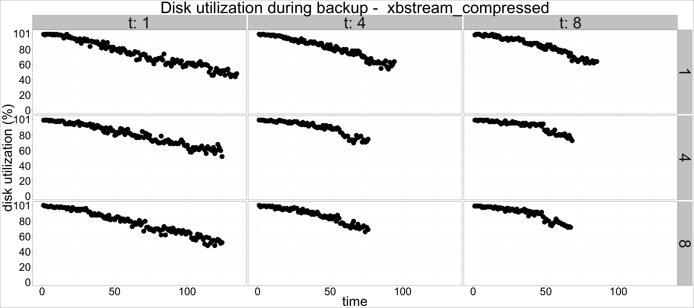
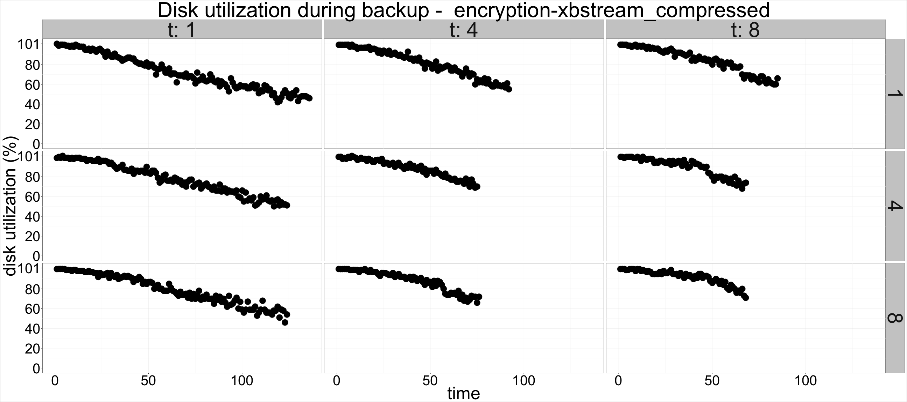

---

title: "Percona Xtrabackup: Compression and Encryption performance"
author: "Percona Lab"
generated on:August 27, 2016
output:
  html_document:
    self_contained: false 
    lib_dir: libs
<!--  md_document:
    variant: markdown_github -->

---

# Percona Xtrabackup 2.3.4 - Encryption and Compression performance 

## Setup

* Client and server on the same machine 
* Sysbench oltp workload running during all tests
* 21GB datadir (restored between tests)
* CPU: 48 logical CPU threads (Intel(R) Xeon(R) CPU E5-2680 v3 @ 2.50GHz). 
* Memory: 120GB. 
* Disk: Intel 3600 nvme 
* Encryption (E) and Compression (C) tested with 1, 4, 8, 16 and 32 threads

In all cases, the experiment was run as follows :
- sysbench oltp runs for 10 seconds
- xtrabackup starts
- sysbench oltp continues for 20 seconds after xtrabackup completes
- Streamed backups are sent to /dev/null
- Local backups are written to the same ssd where MySQL's datadir
  lives. 

In all the graphs presented here, threads is the argument to
--compress-threads or --encrypt-threads, and parallel_threads is the
argument to --parallel

## Backup duration 

Backup duration by type and number of threads, faceted by
parallel_threads. The
horizontal line on each graph shows the duration for the baseline (non
compressed, non encrypted) backup. 

## Impact on throughput

The following chart shows the .99 percentile throughput for each
experiment, by backup type, threads and parallel threads. The
horizontal lines show the .99 percentile of throughput for a
sysbench run with no concurrent backup and for the
baseline backup. 

### Disk activity

The following graph shows disk busy percentage (as reported by
pt-diskstats) per parallel threads, by backup type and threads.

