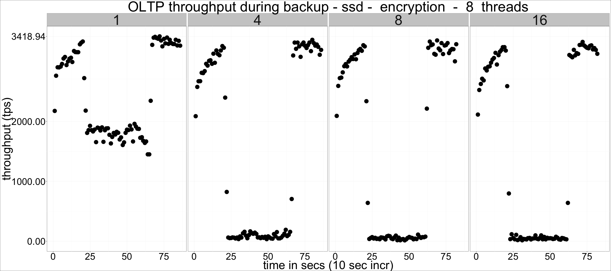
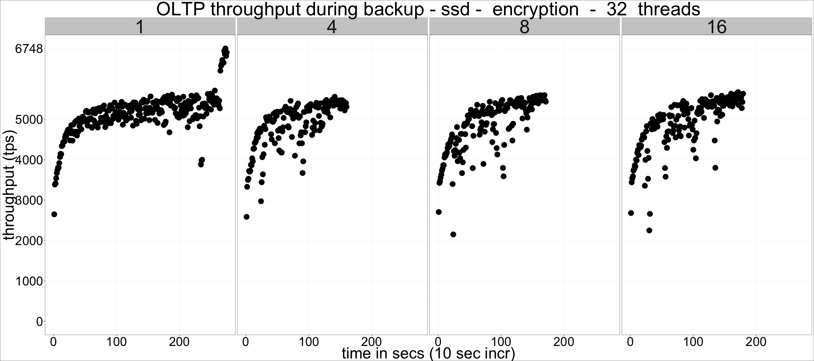
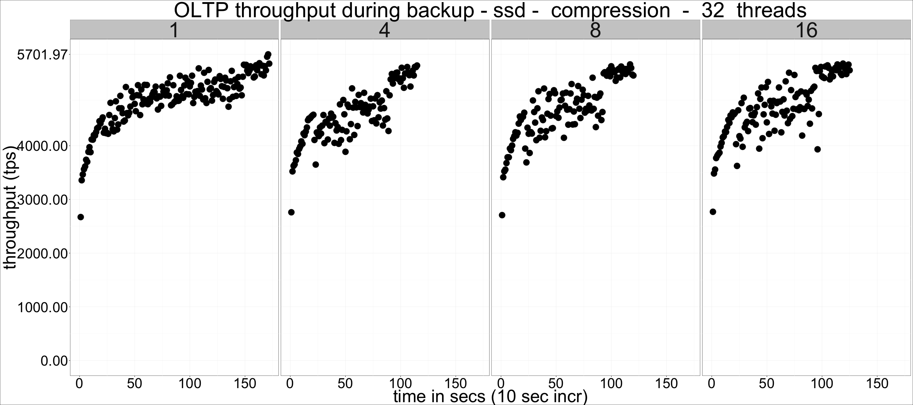
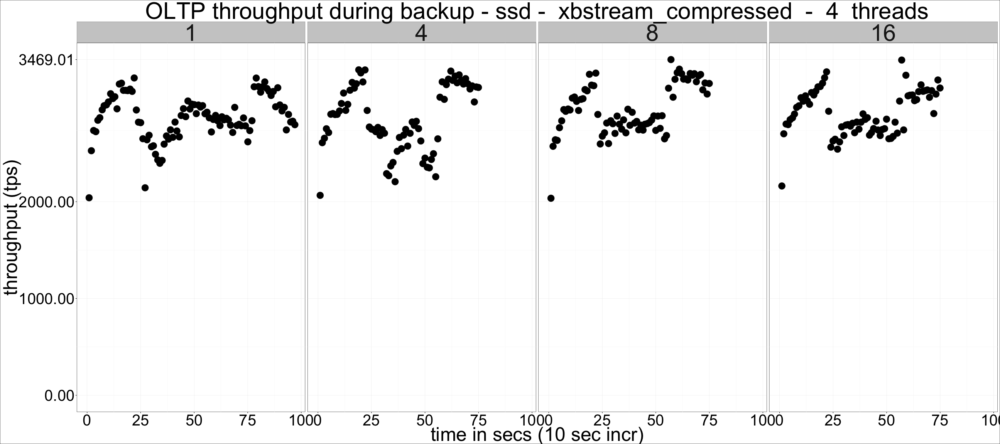
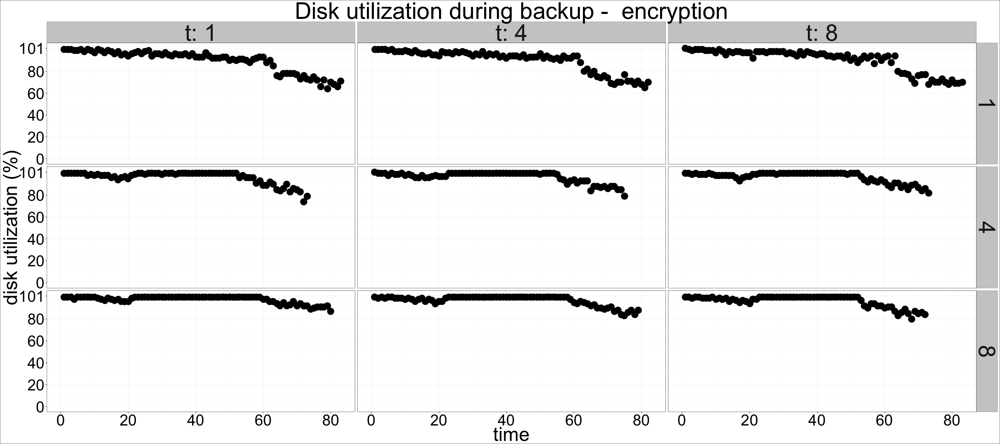

---

title: "Percona Xtrabackup: Compression and Encryption performance"
author: "Percona Lab"
generated on:August 15, 2016
output:
  html_document:
    self_contained: false 
    lib_dir: libs
<!--  md_document:
    variant: markdown_github -->

---

# Percona Xtrabackup 2.3.4 - Encryption and Compression performance 

## Setup

* Client and server on the same machine 
* Sysbench oltp workload running during all tests
* 21GB datadir (restored between tests)
* CPU: 48 logical CPU threads (Intel(R) Xeon(R) CPU E5-2680 v3 @ 2.50GHz). 
* Memory: 120GB. 
* Disk: hdd (HGST HUH728080ALE600), ssd (Intel 3600 nvme) 
* Encryption (E) and Compression (C) tested with 1, 4, 8, 16 and 32 threads

## Backup duration 

Backup duration by type, number of threads, and disk type, faceted by
--parallel threads. The
horizontal line on each graph shows the duration for the baseline (non
compressed, non encrypted) backup. 

## Impact on throughput

The following graphs show tps for sysbench oltp (16 threads, 10M rows
per table, 16 tables) while xtrabackup runs. Duration is not the same
for all graphs as backups don't all last the same, which is why the
faceting by --parallel threads produces graphs with varying width.  

In all cases, the experiment was run as follows :
- sysbench oltp runs for 10 seconds
- xtrabackup starts
- sysbench oltp continues for 20 seconds after xtrabackup completes

### Disk activity

The following graph shows disk busy percentage (as reported by
pt-diskstats) per parallel threads, by backup type and threads.
In all cases, ssd is the drive hosting MySQL's datadir, and hdd is the
backup destination drive. 

