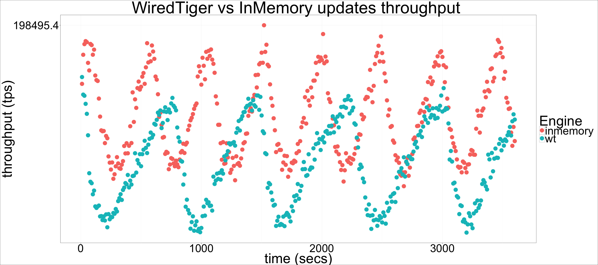

---

title: "Percona Server for MongoDB 3.2.7: WiredTiger vs InMemory sysbench updates performance"

author: "Percona Lab"
generated on:August 10, 2016
output:
  md_document:
    variant: markdown_github

---

# Percona Server for MongoDB 3.2.7-1.1 - WiredTiger vs InMemory sysbench updates performance

## Setup

* WiredTiger: psmdb 3.2.7-1.1 
* InMemory: built from source, v3.2 percona-server-mongodb branch
* sysbench with mongodb support, updates scripts (indexed and non
indexed updates) 
* inMemorySizeGB / wiredTigerCacheSizeGB set to 150GB
* Data set: 8 collections, 10M documents per collection 

## Benchmark procedure

* For WiredTiger: restore the datadir from binary backup before each experiment
* For InMemory: restore the datadir with mongorestore (taken with mongodump from the same data set used to create the binary backup for WiredTiger) before each experiment
* Sysbench runs of 1 hour

